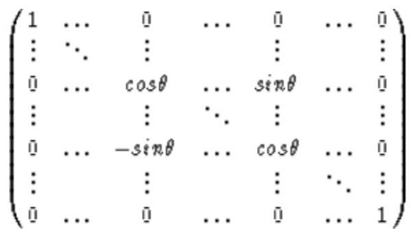

# Quantum vs Classical, Autoregressive vs Reconstructive Encoder/Decoder Architectures on Non-Stationary Time-Series: Loss Landscapes and Latent Complexities with and without Recurrence
## Contents
- [Introduction](#introduction)
  - [Hypotheses](#hypotheses)
- [Model Architectures and Methods](#model-architectures-and-methods)
  - [Data Generation](#data-generation)
  - [Hyperparameter Optimizaiton](#hyperparameter-optimization)
  - [Training](#training)
- [Results](#results)
  - [Classical vs Quantum](#classical-vs-quantum)
    - [Loss Landscape Similarity](#loss-landscape-similarity)
  - [Prediction vs Reconstruction](#prediction-vs-reconstruction)
  - [Recurrence](#recurrence)
- [Discussion](#discussion)
- [Conclusion](#conclusion)
- [Future Work](#future-work)
- [Abbreviations](#abbreviations)
- [References](#references)
- [Useful Commands](#useful-commands)
## Introduction
Time-series data often exhibit complex, non-stationary patterns that pose challenges for modeling and compression. Autoencoders (AEs) have long been used for unsupervised learning of low-dimensional representations (embeddings) of data (Hinton, 2006). A classical AE is typically trained to reconstruct its input after compressing it through a low-dimensional “bottleneck” layer in order to capture the most salient features of the input distribution. In the autoregressive version (herein called a “transition encoder” — TE), the same model architecture takes the current state as input and is trained to predict the next state of a time series, effectively learning to compress the underlying temporal dynamics.

Quantum equivalents have also emerged (Romero, 2017), exploiting quantum superposition and entanglement to achieve more efficient compression or to learn patterns inaccessible to classical networks. In principle, quantum models can represent certain complex transformations with fewer parameters or different capacities than classical neural networks, although their training dynamics can differ significantly due to quantum effects (e.g., interference, measurement noise). This raises questions about how quantum vs. classical architectures compare when applied to learning non-stationary time-series patterns.

Signal complexity metrics – such as Lempel-Ziv complexity (LZC), Hurst exponent (HE), Higuchi fractal dimension (HFD) and differential entropy (DE) – provide quantitative measures of the unpredictability, self-similarity, or information content of time-series data. For example, LZC (Lempel, 1976) measures the number of unique symbols in a sequence, the HE gauges long-range dependence in time-series (with H=0.5 for random walk, H>0.5 indicating persistent long-term correlations, etc.), and the HFD captures the fractal scaling behavior of a signal while the DE extends Shannon entropy (unpredictability) to the continuous realm. This paper hypothesizes that an effective encoder of a time-series should reflect the complexity characteristics of the time series on which it was trained in its bottleneck (the ratio between the metrics should negatively correlate to the loss). In particular, the above-mentioned complexity metrics are expected to correlate between features extracted from the model bottlenecks over its validation series and the validation series themselves from the same dataset on which the model was trained. A high complexity signal might require the encoder to use a similarly high-complexity latent representation to faithfully capture the signal’s variability, especially in a highly non-stationary regime. This is expected for DE in particular because the quantum versions being able to maintain superpositions and mixtures of basis states in the bottleneck that retain uncertainty (entropy), whereas a classical bottleneck might collapse information more deterministically into a few active features, especially given the linear nature of the model architectures. For further analysis in the quantum realm only, correlations are made between each model's validation series complexity metrics and the mean entanglement and mean full VonNeumann entropy (EE and VNE) of its bottleneck states when going through each series.

In this work, I conduct a comprehensive comparison of eight model variants spanning all combinations of:
- Quantum vs. Classical architectures
- Autoencoder vs. Transition Encoder (Autoregressive) objectives
- Minimalist Recurrent vs. Non-Recurrent models

By evaluating these models on the same set of time-series data, the aim is to test several key hypotheses about their performance and internal dynamics. Specifically, the central hypothesis is that transition encoders will converge faster during training, achieve lower loss (error), and produce latent representations that better align with established complexity metrics of the data, compared to traditional autoencoders. The intuition is that because transition encoders are explicitly trained on the temporal relationships (the state-to-state transitions), they intrinsically have better access to the underlying non-stationary patterns and dynamics of the sequence. This should make it easier for them to learn structure that a standard autoencoder objective might miss if the distribution shifts over time. An additional hypothesis is that recurrence being added to the autoencoder objective will not be enough to outcompete the autoregressive versions without recursion, especially since the implemented recursion adds only a single extra parameter.

Furthermore, I investigate expected differences between quantum and classical variants. Quantum models, implemented via parametrized quantum circuits, often exhibit highly non-linear loss landscapes (Holzer, 2024). Despite attempting to increase the similarity of the classical and quantum loss landscapes by mixing the effects of the classical parameters in the linear layers [(details)](#model-architectures-and-methods), I expect that the quantum variants will still have more rugged loss landscapes, characterized by larger first and second derivatives and more high-frequency content in the derivatives spectrum, compared to their classical analogues. This expectation comes mostly from parameter entanglement causing sharpness and also partially from the cyclical nature of the single-qubit gate parameterization causing more oscillations in the loss landscape.

In summary, this paper drafts a systematic study of how learning objective (reconstruction vs. prediction), sequence modeling capability (recurrent vs. not), and computational paradigm (quantum vs. classical) affect performance when trained on complex, highly nonstationary time-series data. The experimental setup and initial expectations are outlined below, and provide a structured framework for results and analysis.

### Hypotheses
This study evaluates all 2×2×2 combinations of the above factors, and is, to my knowledge, the first to directly compare quantum and classical sequence encoder-decoder (ENC-DEC) architectures on non-stationary data. The key hypotheses examined include:
- ***Prediction vs Reconstruction Objective:*** Autoregressive tasks (predicting the next state) will converge faster and attain lower final cost than reconstruction on the same highly non-stationary data. I posit that, in such a highly non-stationary regime, predicting the next state is an easier and more informative task for capturing the dynamics relevant to the task than reconstructing the input is. A transition-based training signal directly emphasizes learning the evolving pattern, which should also translate into better alignment with the dataset’s complexity (e.g., chaotic or highly complex sequences should force the model to utilize its capacity more effectively). This paper will also assess if transition encoders indeed show improved training efficiency (more negative slope to the reconstruction/prediction loss history). Additionally, an examination will be done into whether the learned latent representations from transition models correlate more strongly with known complexity measures (i.e. higher latent entropy for higher complexity data), supporting the idea that they “encode complexity” more faithfully than an ENC-DEC trained on reconstruction.
- ***Recurrent vs Feedforward:*** Recurrent models will outperform non-recurrent models in final loss because the hidden state contains temporal information relevant to the nonstationarity but the difference will be smaller in the quantum architecture because of the facts that its latent state is exponentially larger than its classical counterpart despite having a single qubit per feature and that the quantum embedding only uses single-qubit rotation gates, thus preventing full utilization of the embedding space. Moreover, recurrent encoders will exhibit different bottleneck characteristics, potentially higher entropy, since the hidden state provides an additional pathway to carry information.
- ***Quantum vs Classical:*** In their cost histories, quantum models will have higher mean absolute first and second derivatives during training. Upon analyzing the power spectrum of the loss gradients over training iterations, I additionally expect to see more high-frequency fluctuations for quantum models, reflecting parameter interference effects and more rapid changes as the quantum circuit parameters navigate a more rugged energy landscape. Additionally, I expect higher bottleneck DE in quantum models because quantum mondels won't “collapse” information as starkly as classical ones since the latent space is so much larger, potentially distributing information more evenly among latent degrees of freedom. I will quantify this by measuring DE of classical latent vectors and VNE of quantum latent states (post-encoding), comparing the values across architectures.

## Methods
### Model Architectures
To make a fair comparison between classical and quantum approaches, the [classical network architecture](./models.py#L212) is designed to mirror the [quantum one](./models.py#L14) in terms of structure and parameter count as closely as possible. Both are essentially ENC-DEC pairs with one or more layers (blocks) of transformation in the encoder and a corresponding inverse transformation in the decoder. All models have their latent dimensionality enforced via a cost function term - heretoforth referred to as the "bottleneck trash feature penalty" (BTFP) loss term. During training, the weighting for the trash feature information penalty starts just above 0 and is linearly increased each epoch until it reaches a desired maximum. This helps prevent mode collapse while still allowing time to learn the encoding before having to learn to compress. The key differences are in the way that correlationary coupling is introduced, the size of the space in which each fetaure's rotations can happen (the Hilbert space of the quantum architecture being exponentially larger) and the exact function used to calculate the BTFP. For simiplicity, all architectures are restricted to a linear regime. Even the recurrence is linear, being implemented as minimalistically as possible with a single scalar parameter that is transformed to be a value between 0 and 1 using a sigmoid function. This effective free parameter range enforcement is necessary for the quantum bottleneck state to maintain validity after the recurrence operation and is copied to the classical version for parity. Other than this, parameter count parity is maintained across all models. However this single extra parameter does constitute an entire 1/8 extra parameters over the non-recurrent models because the parameter counts were kept low in order to keep the training time per model low enough that 8 * (number of datasets) models could be trained in time.

For simplicity in creating a classical analogue, the quantum architecture restricts each block to a layer with single-qubit rotation gates followed by a ring entanglement layer and embeds each feature into its own qubit. [It's BTFP](./loss.py#L27) is calculated by sorting the marginal probability of the bottleneck density matrix (between the encoder and decoder) and then summing the (number of qubits - bottleneck size) lowest marginals. All quantum circuits were simulated on classical hardware in order to rule out noise as a complicating factor for the conclusions and due to the difficulty in implementing a dynamic trash qubit index determination without the use of a simulator.

In the classical architecture, each block is a [RingGivensRotationLayer](./models.py#L178) with a number of free parameters equal to both the input and output dimension. Unfortunately, due to dimensionality constraints, it is not possible to maintain perfect transformational parity with the quantum ansatz. This experiment breaks that parity by not enforcing the special orthogonal (SO) Lie group for the per-feature rotations but still maintains global SO adherance for the final weight matrix. SO is a subgroup of the unitary (U) Lie group (lies inside it's manifold since the complex part is 0). It is well documented that Givens matrices have the U Lie group (Givens, 1958). This layer construction uses each free parameter as an angle in a n/2 × n/2 Givens matrix and constructs unique rotations for each feature (as in the quantum ansatz). Importantly, the SO group is preserved under matrix multiplication (Golub, 2013). This allows the use of individual 2×2 SO matrices (one per feature) embedded along the diagonal of the full-dimensional identity matrix in a banded fashion, which most closely resembles ring entanglement in the final linear layer weight matrix (see [definition of planes in a ring](./models.py#L192) and Figure figure_num_a below) to be multiplied together while still restricting to the SO group at the global level. Unfortunately, this necessarily breaks the enforcement of unitarity on each individual rotation due the the afore-mentioned dimensionality constraints. 

While this "coupling" is not a perfect analogue to the quantum architecture — since in a quantum system the qubits themselves are inherently correlated — it does allow a type of correlation between the effects of each feature's rotations. This engineered coupling mimics, to some extent, the way local gate parameters interact in quantum circuits, though it does not reproduce the full complexity of quantum entanglement. In the Banded givens rotations parameterization, the coupling is a consequence of the mapping process itself. In entanglement, the coupling arises due to the physical evolution governed by the Hamiltonian of an interacting system and the tensor product structure of the Hilbert space. In a quantum system, the non-separability of the state (entanglement) is a fundamental property with deep implications—for example, violating Bell inequalities and enabling non-classical information processing. These correlations are intrinsic to the quantum state and are subject to rules of quantum mechanics.

The [BTFP for the classical architecture](./loss.py#L60) is the sum of the lowest activation values in the bottleneck.

### Data Generation
Multivariate time series are synthesized by concatenating blocks where each feature is a separate fractional Brownian motion (FBM) series, which is a zero‑mean Gaussian process characterized by a target HE to control long‑range dependence. The mean and variance of the block are then set to different values per feature and change between each consecutive block to induce nonstationarity based on another FBM sequence that gets passed through a sine to introduce nonlinearity and control amplitude. Based on the dataset index, its generated series progressively include fewer unique blocks with tiling enforcing a fixed length, which slowly decreases the maximum possible Lempel-Ziv complexity value. Sequences are then randomly shuffled and then representative sequences are then selected via 3D binning in the space of LZC, HE, and HFD. These sample sequences are ensured to be in the validation set so that there is a good spread of metric values to use when looking at relationships during the analysis. In order to ensure a reasonable amount of training data for each dataset, the grid was limited to choosing at most a third of the series in each dataset. The unchosen sequences are then split between each dataset's training and validation partitions as close as possible to a desired split ratio and the size of each validation partition is then standardized to the maximum validation partition size. For the experimental results in this paper, a ratio of 2/3 training to 1/3 validation is used.

### Hyperparameter Optimization
Hyperparameter optimization was done over the same validation set for each config, following the standard definition of hyperparameter tuning. Hyperband was used to efficiently search this space, which allocates the number of training epochs as a resource and uses successive halving to prune underperforming configurations (Lisha, 2018). In the implementation used, a series of “brackets” are created based on the maximum number of training epochs and a reduction factor, iterating from the most exploratory (many configurations, few epochs) to the most exploitative (few configurations, many epochs) phases ([`hyperband_search(...)`](./optimize_hyperparams.py#L63)).
- **Data Sampling:** One training and one validation series are randomly sampled from each dataset partition using the `get_best_config` routine, providing a representative but lightweight evaluation set.
- **Configuration Sampling:** The [`sample_hyperparameters(...)`](./optimize_hyperparams.py#L11) function draws candidate settings by:
  - Sampling the learning rate uniformly in log₁₀-space between 10⁻⁴ and 10⁻¹
  - Setting `bottleneck_size` to half the number of features
  - Selecting `num_blocks` uniformly from {1,…,MAX_NUM_BLOCKS} (here, forced to 1 for time constraints)
  - Fixing `max_penalty_weight` at 2.0
  - Randomly choosing `entanglement_gate`, `embedding_gate`, and `block_gate` from predefined lists.
- **Random‑Search Principle:** This stochastic sampling approach is grounded in empirical evidence that random search is more efficient than grid search in high‑dimensional hyperparameter spaces (Bergstra, 2012).
- **Model Evaluation:** Each sampled configuration is evaluated across all eight model variants (quantum/classical × reconstruction/prediction × recurrent/non‑recurrent) by training with the ADAM optimizer ([`train_adam(...)`](./training.py#L23)) and computing the mean training loss from the final `cost_history` entries and validation loss by summing up the per-series values and normalizing each by the size of its partition.
- **Overfitting Detection:** Configurations for which the validation loss exceeds 150% of the training loss after at least 10 epochs are penalized with an infinite cost via, effectively discarding overfitting settings.
- **Complexity Scaling:** To account for model capacity, the raw loss is scaled by the ratio of `num_blocks` to `MAX_NUM_BLOCKS` (1), penalizing more complex configurations proportionally.
- **Successive Halving:** Within each Hyperband bracket, the candidate pool is reduced by the `reduction_factor` (default 4 due to time constraints) each round while the epoch budget per surviving configuration increases, ensuring that the best-performing settings are progressively refined and ultimately selected based on minimum scaled loss.

This Hyperband‑based strategy efficiently balances the exploration of diverse hyperparameter regions with the exploitation of promising configurations, providing a single optimal set of hyperparameters for all model types in the experiment.

### Training
All models are trained using an ADAM optimizer together with finite‑difference gradient estimation to accommodate the non‑differentiable quantum circuits. A truncated version of finite differences (only single, shared, calculation for first point in all gradient calculations for that epoch) was used to increase training speed. Reproducibility and early‑stage flexibility are balanced via teacher forcing inside the cost functions (so models never deal with their own noise) and a linearly increasing BTFP weight based on epoch percentage progression. Trainable parameters are initialized from a uniform distribution in \([-π, π]\), and the first- and second-moment vectors (moment1, moment2) are set to zero. Finally, `np.random.seed(RANDOM_SEED)` is set before each model training to ensure consistent initialization across runs.

## Results
!TODO! Describe chosen way to extend LZC to continuous signal
- scaling factor is removed from BTFP cost history (for analysis only)
### Classical vs Quantum
- Quantum bottleneck features used are each qubit's marginal probability of |0> (for analysis only)
#### Loss Landscape Similarity
### Prediction vs Reconstruction
### Reccurence

## Discussion

## Conclusion

## Future Work
- Many blocks per model half
  - Look at total information content in each block along encoder and decoder
    - Would expect encoder to *slowly decrease* and decoder to *quickly increase*
- More features w/ different entanglement topologies and equivalent classical "coupling" mechanisms
- Add nonlinearities
- Attempt to use data generation that has opposing trends for complexity metric targets (target HE)
- Chaotic time series
- Composite regimes (same randomly sampled sequence of generators for each series in dataset and different sequence per dataset)
- Try without pre-specifying a bottleneck size by extending the trash cost functions to just sum across all features to get something like total n-dimensional distance from 0 at the bottleneck
- Try adding back the linearly increased probabilistic use of their own noise (see commits `b134b50` and `20c5cad`)

## Abbreviations
- AE = Auto-encoder
- BTFP = Bottleneck Trash Feature Penalty
- DE = Differential Entropy
- EE = Entanglement entropy
- ENC-DEC = Encoder-Decoder
- FBM = Fractional Brownian Motion
- HE = Hurst Exponent
- HFD = Higuchi Fractal Dimension
- LZC = Lempel-Ziv Complexity
- SO = Special Orthogonal
- TE = Transition Encoder (autoregressive encoder / decoder)
- U = Unitary
- VNE = VonNeumann Entropy

## References (BibTex)
1. @article{
doi:10.1126/science.1127647,
author = {G. E. Hinton  and R. R. Salakhutdinov },
title = {Reducing the Dimensionality of Data with Neural Networks},
journal = {Science},
volume = {313},
number = {5786},
pages = {504-507},
year = {2006},
doi = {10.1126/science.1127647},
URL = { https://www.science.org/doi/abs/10.1126/science.1127647 },
eprint = { https://www.science.org/doi/pdf/10.1126/science.1127647 },
abstract = {High-dimensional data can be converted to low-dimensional codes by training a multilayer neural network with a small central layer to reconstruct high-dimensional input vectors. Gradient descent can be used for fine-tuning the weights in such “autoencoder” networks, but this works well only if the initial weights are close to a good solution. We describe an effective way of initializing the weights that allows deep autoencoder networks to learn low-dimensional codes that work much better than principal components analysis as a tool to reduce the dimensionality of data.}}
1. @article{Romero_2017,
title={Quantum autoencoders for efficient compression of quantum data},
volume={2},
ISSN={2058-9565},
url={ http://dx.doi.org/10.1088/2058-9565/aa8072 },
DOI={10.1088/2058-9565/aa8072},
number={4},
journal={Quantum Science and Technology},
publisher={IOP Publishing},
author={Romero, Jonathan and Olson, Jonathan P and Aspuru-Guzik, Alan},
year={2017},
month=aug, pages={045001} }
1. @article{1055501,
author={Lempel, A. and Ziv, J.},
journal={IEEE Transactions on Information Theory},
title={On the Complexity of Finite Sequences},
year={1976},
volume={22},
number={1},
pages={75-81},
keywords={},
doi={10.1109/TIT.1976.1055501}}
1. @misc{holzer2024spectralinvariancemaximalityproperties,
title={Spectral invariance and maximality properties of the frequency spectrum of quantum neural networks},
author={Patrick Holzer and Ivica Turkalj},
year={2024},
eprint={2402.14515},
archivePrefix={arXiv},
primaryClass={quant-ph},
url={ https://arxiv.org/abs/2402.14515 },
}
1. @article{doi:10.1137/0106004,
  author  = {Givens, Wallace},
  title   = {Computation of Plain Unitary Rotations Transforming a General Matrix to Triangular Form},
  journal = {Journal of the Society for Industrial and Applied Mathematics},
  volume  = {6},
  number  = {1},
  pages   = {26-50},
  year    = {1958},
  doi     = {10.1137/0106004},
  URL     = { https://doi.org/10.1137/0106004 },
  eprint  = { https://doi.org/10.1137/0106004 }
}
1. @book{golub2013matrix,
  title     = {Matrix Computations},
  author    = {Golub, Gene H. and Van Loan, Charles F.},
  edition   = {4},
  year      = {2013},
  publisher = {Johns Hopkins University Press},
  address   = {Baltimore, MD},
  isbn      = {978-1421407944},
}
1. @article{JMLR:v18:16-558,
  author  = {Lisha Li and Kevin Jamieson and Giulia DeSalvo and Afshin Rostamizadeh and Ameet Talwalkar},
  title   = {Hyperband: A Novel Bandit-Based Approach to Hyperparameter Optimization},
  journal = {Journal of Machine Learning Research},
  year    = {2018},
  volume  = {18},
  number  = {185},
  pages   = {1--52},
  url     = {http://jmlr.org/papers/v18/16-558.html}
}
1. @article{JMLR:v13:bergstra12a,
  author  = {James Bergstra and Yoshua Bengio},
  title   = {Random Search for Hyper-Parameter Optimization},
  journal = {Journal of Machine Learning Research},
  year    = {2012},
  volume  = {13},
  number  = {10},
  pages   = {281--305},
  url     = {http://jmlr.org/papers/v13/bergstra12a.html}
}

## Useful Commands
To determine how many datasets need models trained over them based on the saved grid files ("series_cell_..."), use `find generated_datasets.4qubits/ -iname series_cell_\*dataset\*.npy | sed -E 's/.*series_cell.*dataset(.*)\.npy/\1/' | sort | uniq | wc -l`