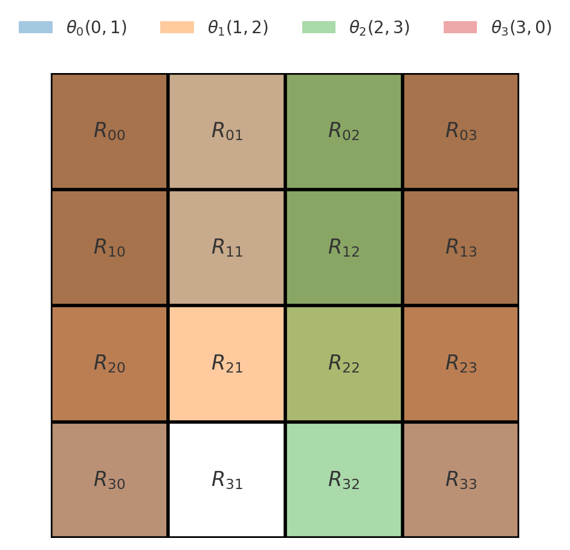

# Quantum vs Classical, Autoregressive vs Reconstructive Encoder/Decoder Architectures on Non-Stationary Time-Series: Loss Landscapes and Latent Complexities with and without Recurrence
## Contents
- [Abstract](#abstract)
- [Introduction](#introduction)
  - [Hypotheses](#hypotheses)
- [Methods](#methods)
  - [Model Architectures](#model-architectures)
  - [Data Generation](#data-generation)
  - [Hyperparameter Optimization](#hyperparameter-optimization)
  - [Training](#training)
  - [Experimental Environment](#experimental-environment)
  - [Analysis](#analysis)
    - [Quantization Methods](#quantization-methods)
    - [Metric Normalization](#metric-normalization)
- [Results](#results)
  - [Loss Landscape Similarities](#loss-landscape-similarities)
  - [Series/Latent Complexity Fidelity](#serieslatent-complexity-fidelity)
  - [Generalization](#generalization)
- [Discussion](#discussion)
  - [Prediction vs Reconstruction](#prediction-vs-reconstruction)
  - [Recurrent vs Feedforward](#recurrent-vs-feedforward)
  - [Quantum vs Classical](#quantum-vs-classical)
  - [Latent Complexity Matching](#latent-complexity-matching)
  - [Sources of Error](#sources-of-error)
- [Conclusion](#conclusion)
- [Future Work](#future-work)
- [Abbreviations](#abbreviations)
- [References](#references)
- [Useful Commands](#useful-commands)
## Abstract

This work systematically investigates the performance of quantum versus classical, recurrent vs feedforward and autoregressive vs reconstructive encoder/decoder models on generated highly non‑stationary time‑series datasets of varying complexities.
The objective is to understand the impact of these design choices on loss landscape characteristics and the complexity of learned latent representations.
A model for each possible combination of factors (8) was trained over each dataset (25) for a total of 200 models.
A systematic analysis of loss landscape properties (initial slope, curvature, and high-frequency fluctuation spectra) is done alongside latent representation fidelity analysis that is quantified via four main complexity metrics: Hurst Exponent, Optimized Multiscale Permutation Entropy, Differential Entropy and Lempel‑Ziv Complexity.
Results show that autoregressive models converge faster and achieve lower final validation loss than reconstructive counterparts across both classical and quantum domains.
Recurrent architectures increased loss landscape steepness and curvature but did not improve final training or validation loss.
Unfortunately, the quantum models ran into an issue with static loss history, which prevented the ability to draw general conclusions from comparing those two groups.
These findings highlight the interplay of learning objective, recurrence, and entanglement topology in designing effective encoder–decoder frameworks for highly non-stationary time-series data.

## Introduction
Time-series data often exhibit complex, non-stationary patterns that pose challenges for modeling and compression.
Autoencoders (AEs) have long been used for unsupervised learning of low-dimensional representations (embeddings) of data (Hinton, Salakhutdinov; 2006).
A classical AE is typically trained to reconstruct its input after compressing it through a low-dimensional “bottleneck” layer in order to capture the most salient features of the input distribution.
In the autoregressive (AR) version, the same model architecture takes the current state as input and is trained to predict the next state of a time series, effectively learning to compress the underlying temporal dynamics.

Quantum equivalents have also emerged (Romero, Olsen, Aspuru-Guzik; 2017), exploiting quantum superposition and entanglement to achieve more efficient compression or to learn patterns inaccessible to classical networks.
In principle, quantum models can represent certain complex transformations with fewer parameters or different capacities than classical neural networks, although their training dynamics can differ significantly due to quantum effects (e.g., interference, measurement noise).
This raises questions about how quantum vs. classical AE architectures compare when applied to learning compression of non-stationary time-series.

This work conducts a comprehensive comparison on non-stationary data of eight sequence encoder-decoder (ENC-DEC) variants spanning all 2×2×2 combinations of:
- Quantum vs. Classical architectures
- Prediction (AR) vs. Reconstruction (standard AE) objectives
- Minimalist Recurrent vs. Non-Recurrent models

By evaluating these models on the same sets of time-series data, the aim is to test several key hypotheses about their performance and internal dynamics.

Four main metrics are used to quantify time-series complexity:
- **Lempel‑Ziv Complexity (LZC):** Number of unique substrings needed to span a discrete sequence (Lempel, Ziv; 1976).
- **Hurst Exponent (HE):** Measures long-range dependence (H=0.5 for random walk; H > 0.5 indicates persistence) (Hurst; 1951).
- **Optimized Multiscale Permutation Entropy (MPE):** Extends classic permutation entropy by computing the Shannon entropy of ordinal-pattern distributions over multiple coarse-grained versions of the signal—thereby capturing scale-dependent structural complexity without any amplitude binning (Want et al.; 2019).
- **Differential Entropy (DE):** Extension of Shannon entropy to continuous-valued data.

In summary, this paper drafts a systematic study of how learning objective (reconstruction vs. prediction), sequence modeling capability (recurrent vs. not), and computational paradigm (quantum vs. classical) affect performance, loss landscape and complexity matching when trained on complex, highly nonstationary time-series data.

### Related Work
Early theoretical work characterized the critical points and minima of linear autoencoders as well as examining how regularization alters the loss landscape geometry of these models (Kunin, Goeva, Zare; 2019).
It showed that linear autoencoders with L₂ normalization remain symmetric at every stationary point and recover the principal axes of the data, which correspond to the decoder’s left singular vectors.
However, this focused on classical model architectures and does not attempt to understand how loss landscape structure varies across different learning tasks (reconstructive vs predictive objectives).
While complexity matching effects have been observed in physiological and neural systems (Almurad et al.; 2018), their implications for autoencoders under nonstationarity remain largely unexplored.
In 2023, Hu et al. looked into enforcing complexity matching between the latent and data distributions, showing that the addition of a complexity matching term to the loss function improves loss and generalization for _stationary_ data but this also uses a two-stage training method that trains encoder and decoder separately, imposing abnormal training dynamics on the model.

### Hypotheses
The key hypotheses examined include:
> - ***Latent Complexity Matching:*** An effective encoder of a time-series is hypothesized to reflect the complexity characteristics of the time series on which it was trained in its bottleneck.
Specifically, the mean squared difference between each metric over each model's validation data and over the model's latent representations from the validation data will positively correlate to the loss achieved by the model.
The intuition behind this prediction is an expectation that a high complexity signal should require the encoder to use a similarly high-complexity latent representation to faithfully capture the signal's variability, especially in a highly non-stationary regime where the variability is volatile.
> - ***Prediction vs Reconstruction Objective:*** AR tasks (predicting the next state) are expected to converge faster and attain lower final cost than reconstruction on the same highly non-stationary data.
In such a highly non-stationary regime, predicting the next state is expected to be an easier and more informative task for capturing the dynamics relevant to the task than reconstructing the input is.
A transition-based training signal directly emphasizes learning the evolving pattern, which should produce a closer match (lower mean squared difference) between the dataset's complexity metrics and those of the model's bottleneck representations since the chosen metrics (except for DE) are based on state ordering, which is something the prediction objective emphasizes but the reconstruction objective does not.
Because it does not directly rely on the ordering of states but instead focuses on the global distribution, an additional hypothesis is that the advantage seen by the prediction-trained models will be less pronounced for DE (see [metric normalization](#metric-normalization)).
To assess if ENC-DEC models trained on the predictive task indeed show improved training efficiency, a check is done for more negative mean slope to the prediction vs reconstruction loss history as well as for less area under the loss history curve.
Another hypothesis this paper proposes is that the learned latent representations from prediction-trained models correlate more strongly with the chosen complexity metrics than the reconstruction-trained ones, supporting the idea that they “encode complexity” more faithfully than an ENC-DEC trained on reconstruction.
Specifically, a check will be made for higher positive slope for first-order line of best fit between each complexity metric calculated over the validation series as well as for a lower mean squared difference between the metric over each series and the metric over the model's bottleneck states.
> - ***Recurrent vs Feedforward:*** Recurrent models will exacerbate the ruggedness of the landscapes (increased steepness, curvature, etc.) but ultimately outperform non-recurrent models in final loss because the hidden state contains temporal information relevant to the nonstationarity.
However, the difference will be smaller in the quantum architecture because of the facts that its latent state is exponentially larger than its classical counterpart despite having a single qubit per feature and that the quantum embedding only uses single-qubit rotation gates, thus preventing full utilization of the embedding space.
Moreover, recurrent encoders will exhibit different bottleneck characteristics, potentially higher entropy, since the hidden state provides an additional pathway to carry information.
Another hypothesis is that recurrence being added to the autoencoder objective will not be enough to outcompete the autoregressive versions without recursion, especially since the implemented recursion adds only a single extra parameter.
> - ***Quantum vs Classical:*** In their cost histories, quantum models will have higher mean absolute first and second derivatives during training because they often exhibit highly non-linear loss landscapes (Holzer, Turkalj; 2024) despite attempting to increase the similarity of the classical and quantum loss landscapes by mixing the effects of the classical parameters in the linear layers [(details)](#model-architectures).
Upon analyzing the power spectrum of the loss gradients over training iterations, an additional expectation is to see more high-frequency fluctuations for quantum models, reflecting parameter interference effects and more rapid changes as the quantum circuit parameters navigate a more rugged loss landscape.
For quantum models, an additional hypothesis is that both the Meyer-Wallach global entanglement (MWGE) and the VonNeumann entropy (VNE) of their bottleneck representations should positively correlate to the main complexity metrics (LZC, HE, MPE, DE).
This is expected for DE in particular because the quantum versions being able to maintain superpositions and mixtures of basis states in the bottleneck that retain uncertainty (entropy), whereas a classical bottleneck might collapse information more consistently into a few active features, especially given the linear nature of the model architectures.
A final expectation is that the quantum models will generalize more poorly (higher ratio of normalized validation cost: normalized training cost) due to the expected higher loss landscape complexity.
To rule out scale differences between the quantum and classical BTFP functions during analysis, their values are normalized by the initial trash cost.

## Methods
### Model Architectures
To make a fair comparison between classical and quantum approaches, the [classical network architecture](./models.py#L212) is designed to mirror the [quantum one](./models.py#L14) in terms of structure and parameter count as closely as possible.
Both are essentially ENC-DEC pairs with one or more layers (blocks) of transformation in the encoder and a corresponding inverse transformation in the decoder.
All models have their latent dimensionality enforced via a cost function term - heretoforth referred to as the "bottleneck trash feature penalty" (BTFP) loss term.
During training, the weighting for the trash feature information penalty starts just above 0 and is linearly increased each epoch until it reaches a desired maximum.
This helps prevent mode collapse while still allowing time to learn the encoding before having to learn to compress.
The key differences are in the way that correlationary coupling is introduced, the size of the space in which each fetaure's rotations can happen (the Hilbert space of the quantum architecture being exponentially larger) and the exact function used to calculate the BTFP.
For simiplicity, all architectures are restricted to a linear regime.
Even the recurrence is linear, being implemented as minimalistically as possible with a single scalar parameter that is transformed to be a value between 0 and 1 using a sigmoid function.
This effective free parameter range enforcement is necessary for the quantum bottleneck state to maintain validity after the recurrence operation and is copied to the classical version for parity.
Other than this, parameter count parity is maintained across all models.
However this single extra parameter does constitute an entire 1/8 extra parameters over the non-recurrent models because the parameter counts were kept low in order to keep the training time per model low enough that 8 * (number of datasets) models could be trained in time as the experiment is performed on an 8-year-old laptop.

For simplicity in creating a classical analogue, the quantum architecture restricts each block to a layer with single-qubit rotation gates followed by a ring entanglement layer and embeds each feature into its own qubit.
[It's BTFP](./loss.py#L27) is calculated by sorting the marginal probability of the bottleneck density matrix (between the encoder and decoder) and then summing the (number of qubits - bottleneck size) lowest marginals.
All quantum circuits were simulated on classical hardware in order to rule out noise as a complicating factor for the conclusions and due to the difficulty in implementing a dynamic trash qubit index determination without the use of a simulator.

In the classical architecture, each block is a [RingGivensRotationLayer](./models.py#L178) with a number of free parameters equal to both the input and output dimension.
Unfortunately, due to dimensionality constraints, it is not possible to maintain perfect transformational parity with the quantum ansatz.
This experiment breaks that parity by not enforcing the special orthogonal (SO) Lie group for the per-feature rotations but still maintains global SO adherance for the final weight matrix.
SO is a subgroup of the unitary (U) Lie group (lies inside it's manifold since the complex part is 0).
It is well documented that Givens matrices (see Figure figure_num_b) have the U Lie group (Givens; 1958).
This layer construction uses each free parameter as an angle in a n/2 × n/2 Givens matrix and constructs unique rotations for each feature (as in the quantum ansatz).
Importantly, the SO group is preserved under matrix multiplication (Golub, Van Loan; 2013).
This allows the use of individual n/2×n/2 SO matrices (one per feature) embedded along the diagonal of the full-dimensional identity matrix in a banded fashion, which most closely resembles ring entanglement in the final linear layer weight matrix (see [definition of planes in a ring](./models.py#L192) and Figure figure_num_a below) to be multiplied together while still restricting to the SO group at the global level.
Unfortunately, this necessarily breaks the enforcement of unitarity on each individual rotation due the the afore-mentioned dimensionality constraints.

*Figure figure_num_b: Construction of a Single Givens Rotation Matrix Embedded in a Larger Matrix.*
*Source: Stanford Exploration Project, “Givens Rotations,” Stanford University, December 18, 1997. [https://sepwww.stanford.edu/data/media/public/docs/sep70/steve2/paper_html/node2.html](https://sepwww.stanford.edu/data/media/public/docs/sep70/steve2/paper_html/node2.html)*


For angle parameters θ, this is the exact boolean mask:
```
{θ0,θ1,θ2,θ3} | {θ0,θ1} | {θ0,θ1,θ2} | {θ0,θ1,θ2,θ3}
{θ0,θ1,θ2,θ3} | {θ0,θ1} | {θ0,θ1,θ2} | {θ0,θ1,θ2,θ3}
{   θ1,θ2,θ3} | {   θ1} | {   θ1,θ2} | {   θ1,θ2,θ3}
{      θ2,θ3} | {     } | {      θ2} | {      θ2,θ3}
```

While this "coupling" is not a perfect analogue to the quantum architecture even beyond the forced break in parity — since in a quantum system the qubits themselves are inherently correlated — it does allow a type of similarity between the effects of each feature's rotations.
This engineered coupling mimics, to some extent, the way local gate parameters interact in quantum circuits, though it does not reproduce the full complexity of quantum entanglement.
In the Banded givens rotations parameterization, the coupling is a consequence of the mapping process itself.
In quantum entanglement, the coupling arises due to the physical evolution governed by the Hamiltonian of an interacting system and the tensor product structure of the Hilbert space.
In a quantum system, the non-separability of the state (entanglement) is a fundamental property with deep implications—for example, violating Bell inequalities and enabling non-classical information processing.
These correlations are intrinsic to the quantum state and are subject to rules of quantum mechanics.

The [BTFP for the classical architecture](./loss.py#L60) is the sum of the lowest activation values in the bottleneck.

### Data Generation
Multivariate time series are synthesized by concatenating blocks where each feature is a separate fractional Brownian motion (FBM) series, which is a nonstationary zero‑mean Gaussian process.
This was done via the Davies-Harte method (Davies, Harte; 1987), which is characterized by a target HE to control long‑range dependence, allowing the creation of and sampling from series with a wide range of values for this metric.
The mean and variance of the block are then set to different values per feature and change between each consecutive block to induce nonstationarity based on another FBM sequence that gets passed through a sine to introduce nonlinearity and control amplitude.
Based on the dataset index, its generated series progressively include fewer unique blocks with tiling enforcing a fixed length, which slowly decreases the maximum possible LZC value.
Sequences are then randomly shuffled and representative sequences are selected via 3D binning in the space of LZC, HE, and MPE (first experiment run was Higuchi Fractal Dimension instead of MPE).
These sample sequences are ensured to be in the validation set so that there is a good spread of metric values to use when looking at relationships during the analysis.
In order to ensure a reasonable amount of training data for each dataset, the grid was limited to choosing at most a third of the series in each dataset.
The unchosen sequences are then split between each dataset's training and validation partitions as close as possible to a desired split ratio and the size of each validation partition is then standardized to the maximum validation partition size.
For the experimental results in this paper, a ratio of 2/3 training to 1/3 validation is used (20 training examples, 10 validation per dataset).

### Hyperparameter Optimization
Hyperparameter optimization was done over the same validation set for each config, following the standard definition of hyperparameter tuning.
Hyperband was used to efficiently search this space, which allocates the number of training epochs as a resource and uses successive halving to prune underperforming configurations (Lisha et al.; 2018).
In the implementation used, a series of “brackets” are created based on the maximum number of training epochs and a reduction factor, iterating from the most exploratory (many configurations, few epochs) to the most exploitative (few configurations, many epochs) phases ([`hyperband_search(...)`](./optimize_hyperparams.py#L63)).
- **Data Sampling:** One training and one validation series are randomly sampled from each dataset partition inside the [`get_best_config(...)`](./optimize_hyperparams.py#L111) routine, providing a representative but lightweight evaluation set.
- **Configuration Sampling:** The [`sample_hyperparameters(...)`](./optimize_hyperparams.py#L11) function draws candidate settings by:
  - Sampling the learning rate uniformly in log₁₀-space between 10⁻⁴ and 10⁻¹
  - Setting `bottleneck_size` to half the number of features
  - Selecting `num_blocks` uniformly from {1,…,`MAX_NUM_BLOCKS`} (here, forced to 1 for time constraints)
  - Fixing `max_penalty_weight` at 2.0
  - Randomly choosing `entanglement_gate`, `embedding_gate`, and `block_gate` from predefined lists.
- **Random‑Search Principle:** This stochastic sampling approach is grounded in empirical evidence that random search is more efficient than grid search in high‑dimensional hyperparameter spaces (Bergstra, 2012).
- **Model Evaluation:** Each sampled configuration is evaluated across all eight model variants (quantum/classical × reconstruction/prediction × recurrent/non‑recurrent) by training with the ADAM optimizer ([`train_adam(...)`](./training.py#L23)) and computing the mean training loss from the final `cost_history` entries and validation loss by summing up the per-series values and normalizing each by the size of its partition.
- **Overfitting Detection:** Configurations for which the validation loss of any model type exceeds 150% of the training loss after at least 10 epochs are penalized with an infinite cost as a heuristic to discard overfitting settings.
- **Complexity Scaling:** To account for model capacity, the raw loss is scaled by the ratio of `num_blocks` to `MAX_NUM_BLOCKS`, penalizing more complex configurations proportionally.
- **Successive Halving:** Within each Hyperband bracket, the candidate pool is reduced by the `reduction_factor` (default 4 due to time constraints) each round while the epoch budget per surviving configuration increases, ensuring that the best-performing settings are progressively refined and ultimately selected based on minimum scaled loss.

This Hyperband‑based strategy efficiently balances the exploration of diverse hyperparameter regions with the exploitation of promising configurations, providing a single optimal set of hyperparameters for all model types in the experiment.
One potential negative consequence of using a single hyperparameter configuration for all datasets, however, is that the hyperparameters could get tuned to be more effective on the data with complexity metric values in higher density areas.
Final configuration (just the non-forced values) = {'learning_rate': 0.021450664374153845, 'entanglement_gate': 'cz', 'embedding_gate': 'rz', 'block_gate': 'rz'}

### Training
All models are trained using an ADAM optimizer together with finite‑difference gradient estimation to accommodate the non‑differentiable quantum circuits.
A truncated version of finite differences (only single, shared, calculation for first point in all gradient calculations for that epoch) was used to increase training speed.
For reproducability, permanent teacher forcing is used inside the cost functions (instead of using a linearly increasing probability of dealing with their own noise).
Early‑stage flexibility is attained via a linearly increasing BTFP weight based on percentage of total epochs elapsed.
This allows the model to learn how to either reconstruct or predict before it learns to compress.
Trainable parameters are initialized from a uniform distribution in \([-π, π]\), and the first- and second-moment vectors (moment1, moment2) are set to zero.
Finally, `np.random.seed(RANDOM_SEED)` is set before each model training to ensure consistent initialization across runs.

### Experimental Environment
All quantum circuits are simulated on classical hardware to isolate algorithmic performance from hardware noise.
Experiment ran on a 2017 MacBook Pro (3.1GHz quad‑core i7, 16GB RAM) without GPU acceleration.

### Analysis
- Scaling factor is removed from BTFP cost history for analysis in order to get a clear understanding of the BTFP itself over time in the plots.
#### Metric Parameter Choices
- **MPE**
  - For the order parameter, values of 2 and 3 are used and the mean value is taken.
This maintains the guideline of sequence length (100) ≫ order! suggested by (Cuesta-Frau et al.; 2019).
  - Multiple time delays are used and the mean result is taken.
The center point for the time delay range is is set to the zero crossing of the signal autocorrelation because it is a key indicator of multi-scale patterns (Kafashi et al.; 2008).
The minimum time delay is calculated as `max(1, min(center_point - 1/20 * sequence_length, 9/10 * center_point))`
The maximum time delay is calculated as `max(center_point + 1/20 * sequence_length, 11/10 * center_point)`
  - The scale parameter is set to 3 in order to ensure that (Wang et al.; 2019).
  - See [implementation](./analysis.py#L229) for further details.
#### Metric Normalization
For comparison across metrics with different scales, theoretical maximum normalization is used for all metrics.
- HE: No normalization necessary because it's already limited to [0,1] by definition.
- MPE: Maximum is `log2(order!)` (Kilpua et al; 2024).
- LZC: Maximum is the sequence length divided by the log of (the sequence length) in base (number of unique symbols) (Kaspar, Schuster; 1987).
- DE: Maximum is the log of the number of unique symbols in the discretized signal.
#### Quantization Methods
When extending a discrete metric to cover continuous data (LZC and DE), multiple quantization methods are used to improve conclusion robustness.
Specifically, the included methods are:
  - [Equal Bin-Width](./analysis.py#L80): Partitions each feature's range into equal‑width bins based on a fixed symbol count (here, 1/10 of the sequence length) then turn each state into a symbol via equal-base mixed-radix encoding.
Fails to adapt to skewed or multimodal distributions.
  - [Bayesian Blocks by (Scargle et al.; 2013)](./analysis.py#L109): Finds an optimal segmentation of one‑dimensional data (quantizes each feature separately) by maximizing a fitness function under a Poisson (event) model.
This yields non‑uniform bin widths that adapt to local data density by creating edges where the statistical properties change, yielding finer resolution in regions of high statistical property fluctuation and coarser bins elsewhere.
An adaptive histogram approach such as this better captures multimodal structure by placing narrow bins around abrupt changes in density and wider bins elsewhere.
This prevents the smoothing over of sharp, localized peaks that uniform binning introduces.
The final symbols are then obtained via mixed-radix encoding with each feature's base being equal to the number of symbols (bins) found for that feature.
  - [HDBSCAN](./analysis.py#L136): Assigns symbols via hierarchical density‑based clustering, uncovering clusters of varying shapes and densities without requiring preset bin counts for each feature.
As per standard practice, the `cluster_selection_epsilon` parameter is set to the mean plus the standard deviation of the interpoint distances between each pair of nearest neighbors.
The chosen `cluster_selection_method` is `'leaf'` for improved granularity.
The `min_cluster_size` is set at 2 to minimize labeling points as noise.

## Results
In the tables below, all quantum models start with a Q, all classical models with a C, all recurrent models have an R, AE signifies reconstruction task and TE means prediction task.
Quantum bottleneck features used are each qubit's marginal probability of |0> (for analysis only - real bottleneck is density matrix).
### Loss Landscape Similarities

  |Model Type|Initial Slope|Final Cost|AUC|
  |----|---------|--------|---------|
  |QAE |  0.00000| 0.19515|  6.04960|
  |QRAE| -0.00049| 0.19590|  6.07370|
  |QTE |  0.00000| 0.19463|  6.03356|
  |QRTE| -0.00048| 0.19537|  6.05742|
  |CAE | -0.04469| 0.59578| 29.08676|
  |CRAE|  0.00325| 1.03308| 32.45470|
  |CTE | -0.04662| 0.52061| 27.38971|
  |CRTE|  0.00439| 1.00555| 31.16774|

  - Mean Initial Slope: Predictive=-0.01068, Reconstructive=-0.01048
  - Mean Final Cost: Predictive=0.47904, Reconstructive=0.50498
  - Mean AUC: Predictive=17.66211, Reconstructive=18.41619
- Gradient Norms
  - Due to a bug with saving the gradient norm history during training, these results are not available
- Prediction Loss
  - Pairwise Pearson Correlation Coefficients for Raw Histories:

  |    | QAE|QRAE| QTE|QRTE|  CAE  | CRAE  |  CTE  | CRTE  |
  |----|----|----|----|----|-------|-------|-------|-------|
  |QAE | nan| nan| nan| nan|  nan  |  nan  |  nan  |  nan  |
  |QRAE| nan| nan| nan| nan|  nan  |  nan  |  nan  |  nan  |
  |QTE | nan| nan| nan| nan|  nan  |  nan  |  nan  |  nan  |
  |QRTE| nan| nan| nan| nan|  nan  |  nan  |  nan  |  nan  |
  |CAE | nan| nan| nan| nan|  1.000| -0.552|  1.000| -0.919|
  |CRAE| nan| nan| nan| nan| -0.552|  1.000| -0.548|  0.830|
  |CTE | nan| nan| nan| nan|  1.000| -0.548|  1.000| -0.917|
  |CRTE| nan| nan| nan| nan| -0.919|  0.830| -0.917|  1.000|
  - Mean Absolute 1st Derivative per Model Type:

  |QAE|QRAE|QTE|QRTE|CAE|CRAE|CTE|CRTE|
  |---|----|---|----|---|----|---|----|
  |0.0000000000|0.0295603101|0.0000000000|0.0292647070|0.4579354477|0.1798117561|0.4775164051|0.2251897169|
  - Mean Absolute 2nd Derivative per Model Type:

  |QAE|QRAE|QTE|QRTE|CAE|CRAE|CTE|CRTE|
  |---|----|---|----|---|----|---|----|
  |0.0000000000|0.0148292331|0.0000000000|0.0146809408|0.0025985003|0.1104035420|0.0034203822|0.1363251462|
  - Pairwise Max Normalized Cross-Correlation of Mean-Centered Raw Histories:

  |    | QAE|QRAE| QTE|QRTE| CAE  | CRAE | CTE  | CRTE |
  |----|----|----|----|----|------|------|------|------|
  |QAE | nan| nan| nan| nan| nan  | nan  | nan  | nan  |
  |QRAE| nan| nan| nan| nan| nan  | nan  | nan  | nan  |
  |QTE | nan| nan| nan| nan| nan  | nan  | nan  | nan  |
  |QRTE| nan| nan| nan| nan| nan  | nan  | nan  | nan  |
  |CAE | nan| nan| nan| nan| 1.000| 0.570| 1.000| 0.919|
  |CRAE| nan| nan| nan| nan| 0.570| 1.000| 0.569| 0.830|
  |CTE | nan| nan| nan| nan| 1.000| 0.569| 1.000| 0.917|
  |CRTE| nan| nan| nan| nan| 0.919| 0.830| 0.917| 1.000|
  - ... 1st Derivatives:

  |    | QAE|QRAE| QTE|QRTE| CAE  | CRAE | CTE  | CRTE |
  |----|----|----|----|----|------|------|------|------|
  |QAE | nan| nan| nan| nan| nan  | nan  | nan  | nan  |
  |QRAE| nan| nan| nan| nan| nan  | nan  | nan  | nan  |
  |QTE | nan| nan| nan| nan| nan  | nan  | nan  | nan  |
  |QRTE| nan| nan| nan| nan| nan  | nan  | nan  | nan  |
  |CAE | nan| nan| nan| nan| 1.000| 0.564| 0.999| 0.477|
  |CRAE| nan| nan| nan| nan| 0.564| 1.000| 0.554| 0.991|
  |CTE | nan| nan| nan| nan| 0.999| 0.554| 1.000| 0.469|
  |CRTE| nan| nan| nan| nan| 0.477| 0.991| 0.469| 1.000|
  - ... 2nd Derivatives:

  |    | QAE|QRAE| QTE|QRTE| CAE  | CRAE | CTE  | CRTE |
  |----|----|----|----|----|------|------|------|------|
  |QAE | nan| nan| nan| nan| nan  | nan  | nan  | nan  |
  |QRAE| nan| nan| nan| nan| nan  | nan  | nan  | nan  |
  |QTE | nan| nan| nan| nan| nan  | nan  | nan  | nan  |
  |QRTE| nan| nan| nan| nan| nan  | nan  | nan  | nan  |
  |CAE | nan| nan| nan| nan| 1.000| 0.581| 0.972| 0.582|
  |CRAE| nan| nan| nan| nan| 0.581| 1.000| 0.595| 1.000|
  |CTE | nan| nan| nan| nan| 0.972| 0.595| 1.000| 0.596|
  |CRTE| nan| nan| nan| nan| 0.582| 1.000| 0.596| 1.000|
  - High Frequency First Derivative Energy Ratios (based on 95% aggregated group energy cutoff ratio)

    Group | QAE | QRAE | QTE | QRTE | CAE | CRAE | CTE | CRTE
    -|-|-|-|-|-|-|-|-
    Quantum | nan | nan | nan | nan | – | – | – | –
    Classical | – | – | – | – | 0.0300 | 0.6422 | 0.0303 | 0.6843
    Recurrent | – | nan | – | nan | – | 0.0351 | – | 0.0413
    Feedforward | nan | – | nan | – | 0.0505 | – | 0.0493 | –
    Reconstructive | nan | nan | – | – | 0.0300 | 0.6422 | – | –
    Predictive | – | – | nan | nan | – | – | 0.0303 | 0.6843
  - High Frequency Second Derivative Energy Ratios (based on 95% aggregated group energy cutoff ratio)

    Group | QAE | QRAE | QTE | QRTE | CAE | CRAE | CTE | CRTE
    -|-|-|-|-|-|-|-|-
    Quantum | nan | nan | nan | nan | – | – | – | –
    Classical | – | – | – | – | 0.0003 | 0.0431 | 0.0006 | 0.0428
    Recurrent | – | nan | – | nan | – | 0.0431 | – | 0.0428
    Feedforward | nan | – | nan | – | 0.0289 | – | 0.0456 | –
    Reconstructive | nan | nan | – | – | 0.0003 | 0.0431 | – | –
    Predictive | – | – | nan | nan | – | – | 0.0006 | 0.0428
- BTFP
  - Pairwise Pearson Correlation Coefficients for Raw Histories:

  |    |  QAE  |  QRAE |  QTE  |  QRTE |  CAE  | CRAE  |  CTE  |  CRTE |
  |----|-------|-------|-------|-------|-------|-------|-------|-------|
  |QAE |  1.000| -0.220|  0.912| -0.220| -0.252|  0.038| -0.256|  0.267|
  |QRAE| -0.220|  1.000| -0.210|  1.000|  0.318| -0.433|  0.319| -0.730|
  |QTE |  0.912| -0.210|  1.000| -0.210| -0.140|  0.183| -0.141|  0.347|
  |QRTE| -0.220|  1.000| -0.210|  1.000|  0.318| -0.433|  0.319| -0.730|
  |CAE | -0.252|  0.318| -0.140|  0.318|  1.000|  0.502|  1.000| -0.178|
  |CRAE|  0.038| -0.433|  0.183| -0.433|  0.502|  1.000|  0.510|  0.759|
  |CTE | -0.256|  0.319| -0.141|  0.319|  1.000|  0.510|  1.000| -0.170|
  |CRTE|  0.267| -0.730|  0.347| -0.730| -0.178|  0.759| -0.170|  1.000|
  - Mean Absolute 1st Derivative per Model Type:

  |QAE|QRAE|QTE|QRTE|CAE|CRAE|CTE|CRTE|
  |---|----|---|----|---|----|---|----|
  |0.0000000000|0.0147310770|0.0000000000|0.0145837662|0.4562267551|0.0694082142|0.4757796760|0.0888645707|
  - Mean Absolute 2nd Derivative per Model Type:

  |QAE|QRAE|QTE|QRTE|CAE|CRAE|CTE|CRTE|
  |---|----|---|----|---|----|---|----|
  |0.0000000000|0.0148239043|0.0000000000|0.0146756653|0.0013651153|0.1076974426|0.0023848520|0.1334352733|
  - Pairwise Max Normalized Cross-Correlation of Mean-Centered Raw Histories:

  |    |   QAE|  QRAE|  QTE | QRTE |  CAE | CRAE | CTE  | CRTE |
  |----|------|------|------|------|------|------|------|------|
  |QAE | 1.000| 0.429| 0.912| 0.429| 0.252| 0.258| 0.256| 0.361|
  |QRAE| 0.429| 1.000| 0.456| 1.000| 0.318| 0.433| 0.319| 0.730|
  |QTE | 0.912| 0.456| 1.000| 0.456| 0.272| 0.282| 0.269| 0.410|
  |QRTE| 0.429| 1.000| 0.456| 1.000| 0.318| 0.433| 0.319| 0.730|
  |CAE | 0.252| 0.318| 0.272| 0.318| 1.000| 0.698| 1.000| 0.427|
  |CRAE| 0.258| 0.433| 0.282| 0.433| 0.698| 1.000| 0.696| 0.759|
  |CTE | 0.256| 0.319| 0.269| 0.319| 1.000| 0.696| 1.000| 0.423|
  |CRTE| 0.361| 0.730| 0.410| 0.730| 0.427| 0.759| 0.423| 1.000|
  - ... 1st Derivatives:

  |    |   QAE|  QRAE|  QTE | QRTE |  CAE | CRAE | CTE  | CRTE |
  |----|------|------|------|------|------|------|------|------|
  |QAE | 1.000| 0.415| 0.929| 0.415| 0.193| 0.363| 0.182| 0.352|
  |QRAE| 0.415| 1.000| 0.385| 1.000| 0.427| 0.967| 0.456| 0.956|
  |QTE | 0.929| 0.385| 1.000| 0.385| 0.202| 0.351| 0.202| 0.342|
  |QRTE| 0.415| 1.000| 0.385| 1.000| 0.427| 0.967| 0.456| 0.956|
  |CAE | 0.193| 0.427| 0.202| 0.427| 1.000| 0.615| 0.990| 0.640|
  |CRAE| 0.363| 0.967| 0.351| 0.967| 0.615| 1.000| 0.655| 0.998|
  |CTE | 0.182| 0.456| 0.202| 0.456| 0.990| 0.655| 1.000| 0.683|
  |CRTE| 0.352| 0.956| 0.342| 0.956| 0.640| 0.998| 0.683| 1.000|
  - ... 2nd Derivatives:

  |    |   QAE|  QRAE|  QTE | QRTE |  CAE | CRAE | CTE  | CRTE |
  |----|------|------|------|------|------|------|------|------|
  |QAE | 1.000| 0.341| 0.950| 0.341| 0.128| 0.345| 0.146| 0.341|
  |QRAE| 0.341| 1.000| 0.335| 1.000| 0.530| 1.000| 0.498| 0.999|
  |QTE | 0.950| 0.335| 1.000| 0.335| 0.168| 0.339| 0.178| 0.336|
  |QRTE| 0.341| 1.000| 0.335| 1.000| 0.530| 1.000| 0.498| 0.999|
  |CAE | 0.128| 0.530| 0.168| 0.530| 1.000| 0.518| 0.949| 0.512|
  |CRAE| 0.345| 1.000| 0.339| 1.000| 0.518| 1.000| 0.497| 1.000|
  |CTE | 0.146| 0.498| 0.178| 0.498| 0.949| 0.497| 1.000| 0.494|
  |CRTE| 0.341| 0.999| 0.336| 0.999| 0.512| 1.000| 0.494| 1.000|
  - High Frequency First Derivative Energy Ratios (based on 95% aggregated group energy cutoff ratio)
    - High Frequency Energy Ratios

    Group | QAE | QRAE | QTE | QRTE | CAE | CRAE | CTE | CRTE
    -|-|-|-|-|-|-|-|-
    Quantum | 0.0122 | 0.0361 | 0.0051 | 0.0361 | – | – | – | –
    Classical | – | – | – | – | 0.0127 | 0.6121 | 0.0124 | 0.5450
    Recurrent | – | 0.0361 | – | 0.0361 | – | 0.0401 | – | 0.0361
    Feedforward | 0.9432 | – | 0.9290 | – | 0.0452 | – | 0.0434 | –
    Reconstructive | 0.9133 | 0.6217 | – | – | 0.0127 | 0.6121 | – | –
    Predictive | – | – | 0.9061 | 0.5235 | – | – | 0.0109 | 0.4585
  - High Frequency Second Derivative Energy Ratios (based on 95% aggregated group energy cutoff ratio)

    Group | QAE | QRAE | QTE | QRTE | CAE | CRAE | CTE | CRTE
    -|-|-|-|-|-|-|-|-
    Quantum | 0.1366 | 0.0391 | 0.1157 | 0.0391 | – | – | – | –
    Classical | – | – | – | – | 0.0010 | 0.0393 | 0.0009 | 0.0384
    Recurrent | – | 0.0391 | – | 0.0391 | – | 0.0393 | – | 0.0384
    Feedforward | 0.9538 | – | 0.9432 | – | 0.0246 | – | 0.0411 | –
    Reconstructive | 0.1366 | 0.0391 | – | – | 0.0010 | 0.0393 | – | –
    Predictive | – | – | 0.1157 | 0.0391 | – | – | 0.0009 | 0.0384


### Series/Latent Complexity Fidelity
- Hurst Exponent:

  Model Type | Pearson  |  MSE
  -----------|----------|-----
  QAE | 0.01442 | 0.05646
  QRAE | 0.10263 | 0.05567
  QTE | 0.07609 | 0.04141
  QRTE | 0.01583 | 0.05897
  CAE | 0.73218 | 0.01149
  CRAE | 0.93175 | 0.00190
  CTE | 0.73296 | 0.01097
  CRTE | 0.93430 | 0.00182
  PCC vs Loss | 0.9404971338803003
  MSE vs Loss | -0.9097356424152886

- Optimized Multiscale Permutation Entropy:

  Model Type | Pearson  |  MSE
  -----------|----------|-----
  QAE | 0.04907 | 0.00688
  QRAE | 0.09330 | 0.01566
  QTE | -0.04163 | 0.00560
  QRTE | 0.03699 | 0.01456
  CAE | 0.84505 | 0.00018
  CRAE | 0.92913 | 0.00007
  CTE | 0.84892 | 0.00018
  CRTE | 0.92687 | 0.00008
  PCC vs Loss | 0.8970087592256916
  MSE vs Loss | -0.7477178051356503

- **Bayesian Block Quantizer**
  - Lempel Ziv Complexity:

    Model Type | Pearson  |  MSE
    -----------|----------|-----
    QAE | 0.29598 | 0.03984
    QRAE | -0.07022 | 0.02480
    QTE | 0.25475 | 0.03597
    QRTE | 0.14785 | 0.03240
    CAE | 0.68438 | 0.00600
    CRAE | 0.55602 | 0.00565
    CTE | 0.68215 | 0.00599
    CRTE | 0.53279 | 0.00571
    PCC vs Loss | 0.6858864023129103
    MSE vs Loss | -0.8395006041574629

  - Differential Entropy:

    Model Type | Pearson  |  MSE
    -----------|----------|-----
    QAE | 0.03857 | 0.08383
    QRAE | -0.08424 | 0.13063
    QTE | -0.00418 | 0.06146
    QRTE | 0.03848 | 0.14455
    CAE | 0.43122 | 0.00411
    CRAE | 0.51761 | 0.00401
    CTE | 0.45339 | 0.00389
    CRTE | 0.51942 | 0.00408
    PCC vs Loss | 0.9068042797965998
    MSE vs Loss | -0.7851408416390093

  Metric  | Pearson  |   MSE
  --------|----------|------
  Hurst Exponent | 0.44252 | 0.02984
  Lempel Ziv Complexity | 0.38546 | 0.01955
  Optimized MPE | 0.46096 | 0.00540
  Differential Entropy | 0.23878 | 0.05457

  |Model|Pearson| MSE  |Validation Loss|
  |-----|-------|------|------|
  |QAE  |  0.039| 0.084| 1.070|
  |QRAE | -0.084| 0.131| 1.074|
  |QTE  | -0.004| 0.061| 1.067|
  |QRTE |  0.038| 0.145| 1.071|
  |CAE  |  0.431| 0.004| 3.147|
  |CRAE |  0.518| 0.004| 5.509|
  |CTE  |  0.453| 0.004| 2.735|
  |CRTE |  0.519| 0.004| 5.351|

  - Pearson correlation coefficients of values from above:

    Group | Pearson vs Loss | MSE vs Loss
    -----|-----|-----
    Quantum        | −0.55826 |  0.82893
    Classical      |  0.94764 |  0.35073
    Recurrent      |  0.98694 | −0.99701
    Non-recurrent  |  0.97939 | −0.96231
    Reconstructive |  0.92486 | −0.84731
    Predictive     |  0.89549 | −0.72923
    **All models** |  0.90680 | −0.78514

- Equal Bin Widths Quantizer
  - Lempel Ziv Complexity:

    Model Type | Pearson  |  MSE
    -----------|----------|-----
    QAE | 0.76124 | 0.00877
    QRAE | 0.56667 | 0.02073
    QTE | 0.73076 | 0.00918
    QRTE | 0.55655 | 0.02127
    CAE | 0.97475 | 0.00159
    CRAE | 0.97240 | 0.00125
    CTE | 0.97557 | 0.00154
    CRTE | 0.97055 | 0.00129
    PCC vs Loss | 0.7996880260125934
    MSE vs Loss | -0.7421782183649015

  - Differential Entropy:

    Model Type | Pearson  |  MSE
    -----------|----------|-----
    QAE | 0.15140 | 0.00001
    QRAE | 0.09074 | 0.00001
    QTE | 0.19481 | 0.00001
    QRTE | -0.02580 | 0.00001
    CAE | 0.64047 | 0.00000
    CRAE | 0.58430 | 0.00000
    CTE | 0.65182 | 0.00000
    CRTE | 0.57465 | 0.00000
    PCC vs Loss | 0.7987992375257185
    MSE vs Loss | -0.8528198792705846

  Metric  | Pearson  |   MSE
  --------|----------|------
  Hurst Exponent | 0.44252 | 0.02984
  Lempel Ziv Complexity | 0.81356 | 0.00820
  Optimized Mpe | 0.46096 | 0.00540
  Differential Entropy | 0.35780 | 0.00000

  | Model | Pearson  |     MSE    | Validation Loss |
  |-------|----------|------------|-----------------|
  | QAE   |  0.15140 |  0.00001   | 1.06962         |
  | QRAE  |  0.09074 |  0.00001   | 1.07379         |
  | QTE   |  0.19481 |  0.00001   | 1.06682         |
  | QRTE  | -0.02580 |  0.00001   | 1.07095         |
  | CAE   |  0.64047 |  0.00000   | 3.14687         |
  | CRAE  |  0.58430 |  0.00000   | 5.50897         |
  | CTE   |  0.65182 |  0.00000   | 2.73496         |
  | CRTE  |  0.57465 |  0.00000   | 5.35108         |

  - Pearson correlation coefficients of values from above:

    | Group          | Pearson vs Loss | MSE vs Loss |
    |----------------|-----------------|-------------|
    | Quantum        | -0.57528        | -0.84489    |
    | Classical      | -0.98940        |  0.96898    |
    | Recurrent      |  0.98883        | -0.99702    |
    | Non-recurrent  |  0.98323        | -0.98767    |
    | Reconstructive |  0.84683        | -0.86559    |
    | Predictive     |  0.75822        | -0.84063    |
    | **All models** |  0.79880        | -0.85282    |

- HDBSCAN Quantizer
  - Lempel Ziv Complexity:

    Model Type | Pearson  |  MSE
    -----------|----------|-----
    QAE | 0.64767 | 0.03905
    QRAE | 0.56677 | 0.02154
    QTE | 0.57625 | 0.03803
    QRTE | 0.60134 | 0.02556
    CAE | 0.99995 | 0.00000
    CRAE | 0.81897 | 0.00202
    CTE | 0.99995 | 0.00000
    CRTE | 0.81581 | 0.00205
    PCC vs Loss | 0.6088854526048683
    MSE vs Loss | -0.795056928525413

  - Differential Entropy:

    Model Type | Pearson  |  MSE
    -----------|----------|-----
    QAE | -0.00539 | 11.55860
    QRAE | -0.04677 | 8.84267
    QTE | -0.01047 | 10.58587
    QRTE | -0.04733 | 6.79822
    CAE | 0.99999 | 0.00011
    CRAE | 0.73157 | 3.97900
    CTE | 0.99999 | 0.00011
    CRTE | 0.72788 | 4.10027
    PCC vs Loss | 0.7465840942913858
    MSE vs Loss | -0.6045431964273741

  Metric  | Pearson  |   MSE
  --------|----------|------
  Hurst Exponent | 0.44252 | 0.02984
  Lempel Ziv Complexity | 0.75334 | 0.01603
  Optimized Mpe | 0.46096 | 0.00540
  Differential Entropy | 0.41868 | 5.73311

  | Model | Pearson   |     MSE     | Validation Loss |
  |-------|-----------|-------------|-----------------|
  | QAE   | -0.00539  | 11.55860    | 1.06962         |
  | QRAE  | -0.04677  |  8.84267    | 1.07379         |
  | QTE   | -0.01047  | 10.58587    | 1.06682         |
  | QRTE  | -0.04733  |  6.79822    | 1.07095         |
  | CAE   |  0.99999  |  0.00011    | 3.14687         |
  | CRAE  |  0.73157  |  3.97900    | 5.50897         |
  | CTE   |  0.99999  |  0.00011    | 2.73496         |
  | CRTE  |  0.72788  |  4.10027    | 5.35108         |

  - Pearson correlation coefficients of values from above:

    | Group          | Pearson vs Loss | MSE vs Loss |
    |----------------|-----------------|-------------|
    | Quantum        | -0.78336        | -0.50735    |
    | Classical      | -0.99176        |  0.99107    |
    | Recurrent      |  0.99975        | -0.93391    |
    | Non-recurrent  |  0.98812        | -0.98615    |
    | Reconstructive |  0.77486        | -0.67758    |
    | Predictive     |  0.71851        | -0.53207    |
    | **All models** |  0.74658        | -0.60454    |

### Generalization
- Validation / Training loss ratios normalized by number of series per partition (lower is more generalized):

  Model | Min | Mean | Max
  ---|---|---|---
  QAE | 0.4350641694234518 | 0.5547538384854458 | 0.769459149698868
  QRAE | 0.4354516628452704 | 0.5546730284144534 | 0.7665008551171881
  QTE | 0.4339883504241621 | 0.5548788644563672 | 0.7696376134222728
  QRTE | 0.4343748317754101 | 0.5547969550324031 | 0.7666825483370352
  CAE | 0.3989963583607772 | 0.5346331264489401 | 0.6819611138231956
  CRAE | 0.4049732191049928 | 0.5389040513871973 | 0.6753386332085912
  CTE | 0.3931151137661798 | 0.5336285601469368 | 0.6988113307483387
  CRTE | 0.4053806543771417 | 0.5393152840260769 | 0.6882955050088161

- Complexity Fidelity vs Generalization Correlations:
  - PCC of HE Pearson vs: -0.92941
  - PCC of HE MSE vs:      0.92448
  - PCC of Optimized MPE Pearson vs: -0.96372
  - PCC of Optimized MPE MSE vs:      0.83839
  - Bayesian Blocks Quantizer
    - PCC of LZC Pearson vs: -0.91653
    - PCC of LZC MSE vs:      0.94292
    - PCC of DE Pearson vs: -0.94406
    - PCC of DE MSE vs:      0.88587
  - Equal Bin Width Quantizer
    - PCC of DE Pearson vs: -0.96947
    - PCC of DE MSE vs:      0.96455
    - PCC of LZC Pearson vs: -0.90805
    - PCC of LZC MSE vs:      0.82729
  - HDBSCAN Quantizer
    - PCC of DE Pearson vs: -0.97083
    - PCC of DE MSE vs:      0.93219
    - PCC of LZC Pearson vs: -0.99884
    - PCC of LZC MSE vs:      0.93708

## Discussion

### Prediction vs Reconstruction
The prediction task beat the reconstruction task on AUC for loss history, on mean final cost and on mean initial slope of loss history over first ten epochs.
The improvement in final loss from using prediction vs reconstruction tasks with recurrent architectures was greater than the loss improvement for feedforward architectures suggesting independent effects that stack.
However, this difference for the quantum models was negligible (`(.1959-.19537)-(.19515-.19463)=.00001`).
Mean validation/training loss ratio of reconstruction models is ~.54574 vs ~.54565 for predictive models (a ~.00009 difference), which is negligible.
The final mean validation loss was better for every predictive model than its equivalent reconstructive, especially for the classical models.
There are no significant loss landscape differences between predictive and reconstructive objectives.

### Recurrent vs Feedforward

Mean first and second derivatives of loss history are both higher for every recurrent version of otherwise equivalent feedforward model architectures.
Additionally, the classical recurrent models have much larger high frequency energy ratio for both first and second derivatives than the classical feedforward models.
Unfortunately, the quantum models gave NaN and thus cannot be compared.
Interestingly recurrence seemed to improve initial slope for quantum models but worsen initial slope for classical models.
Recurrence increased final training loss, validation loss and AUC of loss history, contradicting the hypothesized result.
Recurrence improved the generalization ratio for quantum models but worsened it for both objectives in classical models.
This could be due to the recurrent hidden state scalar multiplier being the only free parameter that does not have any entanglement applied immediately after.
One interesting finding that remains unexplained is that the Pearson correlation coefficients (PCCs) between BTFP histories of all recurrent models and their non-recurrent counterparts are negative except for CRAE and CAE.

### Quantum vs Classical

Quantum and classical models showed strikingly different loss landscapes but not in the way that was predicted.
Quantum models implemented encountered extremely flat loss landscapes, commonly known as barren plateaus, which resulted in near‑zero gradients and hindered optimization.
Excessive entanglement, calculating the prediction loss from density matrix and the use of only z rotation gates in the quantum circuits was linked to these barren plateaus after manual experimentation to find a loss landscape that was not flat.
The flat quantum loss landscape shown in the plots signals a clear disparity between the two model architectures.
All quantum models consistently chose the first two qubits as the trash feature indices at every state in each validation series as seen in the [BTFP index histograms](./images/results/btfp_histograms/).
The classical models in contrast showed much more flexibility in their chosen trash indices.
It seems quite likely, though, that the quantum index choice inflexibility is a direct result of the overentangled topology (circular).
The MWGE and VNE of bottleneck states did not correlate to any complexity metrics over each series.
The only noticable pattern with MWGE and VNE was recurrence shows up (based on line of best fit slope and raw points on the plots).
The quantum models did show poorer generalization based on the validation:training loss ratios as predicted but not because of expected increases in steepness and curvature.

### Latent Complexity Matching
The majority of model types (`1 - 15/(16*8) = 88.28125%` across all metrics, quantization and aggregation methods) show positive line of best fit slope between data and model latent complexity metric values, supporting the hypothesis that a trained ENC-DEC exhibits similar complexity characteristics in its latent representations as that of the time series on which it was trained.
Additionally, with the exception of quantization via HDBSCAN, the PCCs between the latent and original are almost all positive.
However, the models whose latent complexity metrics closely matched the data’s complexity by mean squared error (MSE) did **not** consistently achieve lower errors as predicted when grouping all models together.
In fact the exact opposite trend was observed, with most groups showing negative PCC between latent/series complexity MSE and validation loss as well as positive PCC between latent/series complexity PCCs and validation loss under every quantization method.
However, further inspection reveals a scale difference between the classical and quantum models in both MSE (orders of magnitude) and validation loss that could cause such a disparity.
In fact, grouping by classical and quantum shows a much more promising picture.
Under this grouping, 5/6 PCCs of the complexity matching PCCs vs validation loss are negative as expected, with classical Bayesian quantizer being the only exception.
Additionally, this grouping shows positive PCC for complexity matching MSE vs validation loss for 4/6, with quantum equal-width binning and quantum HDBSCAN being the exceptions.
Models whose latent complexity closely matched the data's complexity metrics by both PCC and MSE also generalize better as measured by the validation:training loss ratios.

### Sources of Error

Three known sources of error impacted the validity of this experiment:
- Barren plateaus in quantum models prevented gradient‑based learning.
- A logical error in the LZC calculation that allowed for overlap of phrases was found after data generation (see lzc_corrections.py from commit 1b51cf870c7df4a98eeb8bf26c07eb09cf77c24f) with the following statistics for their differences: mean=1.04; median=1; max=5; std dev=0.9429.
The correct value was always higher due to this because allowing overlap means a phrase that has already be seen can be used but if extending an unseen phrase does not lead to an already seen phrase, nothing changes.
The minimum correct value for any series in the generated data was 33 for a maximum effect of 15.15% and both a mean and median effect of around 1/33 (3%).
The corrected values are used in analysis, however, so the effect of this is infinitesimal being limited only to how much variety there was in the complexity metrics of the series chosen for the comparison grid.
- Since the original data generation grid choices and data partitions were done with 3D binning based on the Higuchi fractal dimension instead of MPE (before the replacement), the variation in MPE values is much lower than desired.

## Conclusion

This work compared multiple neural architectures on non‑stationary time‑series, revealing clear advantages for recurrent over feedforward and for predictive vs reconstructive models in capturing evolving patterns and long‑term dependencies.
Unfortunately, due to broken parity between the quantum and classical architectures, only limited conclusions can be drawn related solely to comparing the implemented architectures.
Quantum models struggled with barren plateaus caused partially by excessive entanglement, highlighting the importance of entanglement topology for quantum model design.
This study reveals that predictive objectives confer modest but consistent gains over reconstruction in both final loss and early‐epoch dynamics, with particularly clear benefits for classical architectures.
Recurrence, however, proved to be mostly disadvantageous in terms of loss landscape and loss history.
Finally, latent complexity analysis confirms that most trained models correlate complexity over inputs to complexity of that input's latent representation.
However, only when segregating classical and quantum groups do improved complexity‐matching metrics reliably predict lower validation losses and better generalization.
These findings highlight the interplay between model class, training objective, and architectural choices, and they suggest future work should initially focus on optimizing quantum circuit ansatz.

## Future Work
Beyond that, further future work will augment the prediction objective with an explicit complexity-matching term to evaluate its effect on predictive performance.
Another modification could be to extend the reconstruction task so that the model must reconstruct two consecutive states rather than a single state, testing whether this multi-step target leads to better loss or generalization than single state reconstruction.

By increasing the number of blocks in both encoder and decoder pathways, how total information content evolves can be tracked to test for e.g. a gradual decrease through the encoder and a rapid increase in the decoder.
Other architectural improvements to be made are the exploration of varied entanglement topologies alongside equivalent classical coupling mechanisms with more features so that more topologies are possible and the integration of nonlinear activation functions.
Instead of fixing the bottleneck size a priori, future work could extend the “trash” cost function to sum the trash cost of each possible bottleneck size weighted by 1/num_trash_indices, allowing the network to determine its effective bottleneck dimensionality.
One final architectural modification that would be interesting to investigate the impact of in the future is a revisiting of the gradually increasing the probability of forcing the model to deal with its own noise (see commits b134b50 and 20c5cad) instead of using teacher forcing.

On the data side, time series generation with deliberately opposing complexity trends (i.e. targeting high HE with low LZC) can be done to more rigorously test complexity-matching.
It would also be interesting to explore performance on chaotic signals and composite regimes.


## Abbreviations
- AE = Auto-encoder
- AR = Autoregressive
- BTFP = Bottleneck Trash Feature Penalty
- DE = Differential Entropy
- ENC-DEC = Encoder-Decoder
- FBM = Fractional Brownian Motion
- HE = Hurst Exponent
- LZC = Lempel-Ziv Complexity
- MPE = Optimized Multiscale Permutation Entropy
- MSE = Mean Squared Error
- MWGE = Meyer-Wallach Global Entanglement
- PCC = Pearson Correlation Coefficient
- SO = Special Orthogonal
- U = Unitary
- VNE = VonNeumann Entropy

## References
(BibTex format)
1. @article{doi:10.1126/science.1127647,
  author   = {G. E. Hinton  and R. R. Salakhutdinov },
  title    = {Reducing the Dimensionality of Data with Neural Networks},
  year     = {2006},
  journal  = {Science},
  volume   = {313},
  number   = {5786},
  pages    = {504-507},
  doi      = {10.1126/science.1127647},
  URL      = { https://www.science.org/doi/abs/10.1126/science.1127647 },
  eprint   = { https://www.science.org/doi/pdf/10.1126/science.1127647 },
  abstract = {High-dimensional data can be converted to low-dimensional codes by training a multilayer neural network with a small central layer to reconstruct high-dimensional input vectors. Gradient descent can be used for fine-tuning the weights in such “autoencoder” networks, but this works well only if the initial weights are close to a good solution. We describe an effective way of initializing the weights that allows deep autoencoder networks to learn low-dimensional codes that work much better than principal components analysis as a tool to reduce the dimensionality of data.}
}
1. @article{Romero_2017,
  author    = {Romero, Jonathan and Olson, Jonathan P and Aspuru-Guzik, Alan},
  title     = {Quantum autoencoders for efficient compression of quantum data},
  year      = {2017},
  month     = aug,
  ISSN      = {2058-9565},
  url       = { http://dx.doi.org/10.1088/2058-9565/aa8072 },
  DOI       = {10.1088/2058-9565/aa8072},
  number    = {4},
  journal   = {Quantum Science and Technology},
  volume    = {2},
  publisher = {IOP Publishing},
  pages     = {045001}
}
1. @article{1055501,
  author   = {Lempel, A. and Ziv, J.},
  title    = {On the Complexity of Finite Sequences},
  year     = {1976},
  journal  = {IEEE Transactions on Information Theory},
  volume   = {22},
  number   = {1},
  pages    = {75-81},
  keywords = {},
  doi      = {10.1109/TIT.1976.1055501}
}
1. @misc{holzer2024spectralinvariancemaximalityproperties,
  author        = {Patrick Holzer and Ivica Turkalj},
  title         = {Spectral invariance and maximality properties of the frequency spectrum of quantum neural networks},
  year          = {2024},
  eprint        = {2402.14515},
  archivePrefix = {arXiv},
  primaryClass  = {quant-ph},
  url           = { https://arxiv.org/abs/2402.14515 },
}
1. @article{doi:10.1137/0106004,
  author  = {Givens, Wallace},
  title   = {Computation of Plain Unitary Rotations Transforming a General Matrix to Triangular Form},
  year    = {1958},
  journal = {Journal of the Society for Industrial and Applied Mathematics},
  volume  = {6},
  number  = {1},
  pages   = {26-50},
  doi     = {10.1137/0106004},
  URL     = { https://doi.org/10.1137/0106004 },
  eprint  = { https://doi.org/10.1137/0106004 }
}
1. @book{golub2013matrix,
  author    = {Golub, Gene H. and Van Loan, Charles F.},
  title     = {Matrix Computations},
  edition   = {4},
  year      = {2013},
  publisher = {Johns Hopkins University Press},
  address   = {Baltimore, MD},
  isbn      = {978-1421407944},
}
1. @article{JMLR:v18:16-558,
  author  = {Lisha Li and Kevin Jamieson and Giulia DeSalvo and Afshin Rostamizadeh and Ameet Talwalkar},
  title   = {Hyperband: A Novel Bandit-Based Approach to Hyperparameter Optimization},
  year    = {2018},
  journal = {Journal of Machine Learning Research},
  volume  = {18},
  number  = {185},
  pages   = {1--52},
  url     = { http://jmlr.org/papers/v18/16-558.html }
}
1. @article{JMLR:v13:bergstra12a,
  author  = {James Bergstra and Yoshua Bengio},
  title   = {Random Search for Hyper-Parameter Optimization},
  year    = {2012},
  journal = {Journal of Machine Learning Research},
  volume  = {13},
  number  = {10},
  pages   = {281--305},
  url     = { http://jmlr.org/papers/v13/bergstra12a.html }
}
1. @article{2013ApJ...764..167S,
  author        = {{Scargle}, Jeffrey D. and {Norris}, Jay P. and {Jackson}, Brad and {Chiang}, James},
  title         = "{Studies in Astronomical Time Series Analysis. VI. Bayesian Block Representations}",
  year          = 2013,
  month         = feb,
  journal       = {\apj},
  keywords      = {methods: data analysis, methods: statistical, Astrophysics - Instrumentation and Methods for Astrophysics, Mathematics - Statistics Theory, G.3},
  volume        = {764},
  number        = {2},
  eid           = {167},
  pages         = {167},
  doi           = {10.1088/0004-637X/764/2/167},
  archivePrefix = {arXiv},
  eprint        = {1207.5578},
  primaryClass  = {astro-ph.IM},
  adsurl        = { https://ui.adsabs.harvard.edu/abs/2013ApJ...764..167S },
  adsnote       = {Provided by the SAO/NASA Astrophysics Data System}
}
1. @article{doi:10.1061/TACEAT.0006518,
  author   = {H. E. Hurst },
  title    = {Long-Term Storage Capacity of Reservoirs},
  year     = {1951},
  journal  = {Transactions of the American Society of Civil Engineers},
  volume   = {116},
  number   = {1},
  pages    = {770-799},
  doi      = {10.1061/TACEAT.0006518},
  URL      = { https://ascelibrary.org/doi/abs/10.1061/TACEAT.0006518 },
  eprint   = { https://ascelibrary.org/doi/pdf/10.1061/TACEAT.0006518 },
  abstract = { A solution of the problem of determining the reservoir storage required on a given stream, to guarantee a given draft, is presented in this paper. For example, if a long-time record of annual total discharges from the stream is available, the storage required to yield the average flow, each year, is obtained by computing the cumulative sums of the departures of the annual totals from the mean annual total discharge. The range from the maximum to the minimum of these cumulative totals is taken as the required stornge. }
}
1. @article{10.1093/biomet/74.1.95,
  author   = {DAVIES, R. B. and HARTE, D. S.},
  title    = {Tests for Hurst effect},
  year     = {1987},
  month    = {03},
  journal  = {Biometrika},
  volume   = {74},
  number   = {1},
  pages    = {95-101},
  abstract = {We consider the power of tests for distinguishing between fractional Gaussian noise and white noise of a first-order autoregressive process. Our tests are based on the beta-optimal principle (Davies, 1969), local optimality and the rescaled range test.},
  issn     = {0006-3444},
  doi      = {10.1093/biomet/74.1.95},
  url      = { https://doi.org/10.1093/biomet/74.1.95 },
  eprint   = { https://academic.oup.com/biomet/article-pdf/74/1/95/578634/74-1-95.pdf },
}
1. @article{article,
  author  = {Kaffashi, Farhad and Foglyano, Ryan and Wilson, Christopher and Loparo, Kenneth},
  title   = {The effect of time delay on Approximate & Sample Entropy calculations},
  year    = {2008},
  month   = {12},
  pages   = {3069-3074},
  volume  = {237},
  journal = {Physica D: Nonlinear Phenomena},
  doi     = {10.1016/j.physd.2008.06.005}
}
1. @article{Cuesta-Frau2019,
  author  = {Cuesta-Frau, David and Murillo-Escobar, Juan Pablo and Orrego, Diana Alexandra and Delgado-Trejos, Edilson},
  title   = {Embedded Dimension and Time Series Length. Practical Influence on Permutation Entropy and Its Applications},
  year    = {2019},
  journal = {Entropy},
  volume  = {21},
  number  = {4},
  pages   = {385},
  doi     = {10.3390/e21040385}
}
1. @Article{e21020170,
  AUTHOR         = {Wang, Xianzhi and Si, Shubin and Wei, Yu and Li, Yongbo},
  TITLE          = {The Optimized Multi-Scale Permutation Entropy and Its Application in Compound Fault Diagnosis of Rotating Machinery},
  YEAR           = {2019},
  JOURNAL        = {Entropy},
  VOLUME         = {21},
  NUMBER         = {2},
  ARTICLE-NUMBER = {170},
  URL            = { https://www.mdpi.com/1099-4300/21/2/170 },
  PubMedID       = {33266886},
  ISSN           = {1099-4300},
  ABSTRACT       = {Multi-scale permutation entropy (MPE) is a statistic indicator to detect nonlinear dynamic changes in time series, which has merits of high calculation efficiency, good robust ability, and independence from prior knowledge, etc. However, the performance of MPE is dependent on the parameter selection of embedding dimension and time delay. To complete the automatic parameter selection of MPE, a novel parameter optimization strategy of MPE is proposed, namely optimized multi-scale permutation entropy (OMPE). In the OMPE method, an improved Cao method is proposed to adaptively select the embedding dimension. Meanwhile, the time delay is determined based on mutual information. To verify the effectiveness of OMPE method, a simulated signal and two experimental signals are used for validation. Results demonstrate that the proposed OMPE method has a better feature extraction ability comparing with existing MPE methods.},
  DOI            = {10.3390/e21020170}
}
1. @article{PhysRevA.36.842,
  author    = {Kaspar, F. and Schuster, H. G.},
  title     = {Easily calculable measure for the complexity of spatiotemporal patterns},
  year      = {1987},
  journal   = {Phys. Rev. A},
  volume    = {36},
  issue     = {2},
  pages     = {842--848},
  numpages  = {0},
  month     = {Jul},
  publisher = {American Physical Society},
  doi       = {10.1103/PhysRevA.36.842},
  url       = { https://link.aps.org/doi/10.1103/PhysRevA.36.842 }
}
1. @article{Kilpua2024,
  author  = {Kilpua, E. K. J. and Good, S. and Ala-Lahti, M. and Osmane, A. and Koikkalainen, V.},
  title   = {Permutation entropy and complexity analysis of large-scale solar wind structures and streams},
  year    = {2024},
  journal = {Ann. Geophys.},
  volume  = {42},
  pages   = {163--177},
  doi     = {10.5194/angeo-42-163-2024},
  url     = { https://doi.org/10.5194/angeo-42-163-2024 }
}
1. @inproceedings{kunin19a,
  author    = {Kunin, Daniel and Goeva, Aleksandrina and Zare, Mohammad},
  title     = {Loss Landscapes of Regularized Linear Autoencoders},
  year      = {2019},
  booktitle = {Proceedings of Machine Learning Research},
  volume    = {97},
  pages     = {47--55},
  eprint    = {1812.01996},
  url       = { https://proceedings.mlr.press/v97/kunin19a.html }
}
1. @ARTICLE{10.3389/fphys.2018.01766,
  AUTHOR   = {Almurad, Zainy M. H.  and Roume, Clément  and Blain, Hubert  and Delignières, Didier },
  TITLE    = {Complexity Matching: Restoring the Complexity of Locomotion in Older People Through Arm-in-Arm Walking},
  YEAR     = {2018},
  JOURNAL  = {Frontiers in Physiology},
  VOLUME   = {Volume 9 - 2018},
  URL      = { https://www.frontiersin.org/journals/physiology/articles/10.3389/fphys.2018.01766 },
  DOI      = {10.3389/fphys.2018.01766},
  ISSN     = {1664-042X},
  ABSTRACT = {The complexity matching effect refers to a maximization of information exchange, when interacting systems share similar complexities. Additionally, interacting systems tend to attune their complexities in order to enhance their coordination. This effect has been observed in a number of synchronization experiments, and interpreted as a transfer of multifractality between systems. Finally, it has been shown that when two systems of different complexity levels interact, this transfer of multifractality operates from the most complex system to the less complex, yielding an increase of complexity in the latter. This theoretical framework inspired the present experiment that tested the possible restoration of complexity in older people. In young and healthy participants, walking is known to present 1/f fluctuations, reflecting the complexity of the locomotion system, providing walkers with both stability and adaptability. In contrast walking tends to present a more disordered dynamics in older people, and this whitening was shown to correlate with fall propensity. We hypothesized that if an aged participant walked in close synchrony with a young companion, the complexity matching effect should result in the restoration of complexity in the former. Older participants were involved in a prolonged training program of synchronized walking, with a young experimenter. Synchronization within the dyads was dominated by complexity matching. We observed a restoration of complexity in participants after 3 weeks, and this effect was persistent 2 weeks after the end of the training session. This work presents the first demonstration of a restoration of complexity in deficient systems.}
}
1. @inproceedings{hu2023complexity,
  author    = {Tianyang Hu and Fei Chen and Haonan Wang and Jiawei Li and Wenjia Wang and Jiacheng Sun and Zhenguo Li},
  title     = {Complexity Matters: Rethinking the Latent Space for Generative Modeling},
  year      = {2023},
  booktitle = {Thirty-seventh Conference on Neural Information Processing Systems},
  url       = { https://openreview.net/forum?id=00EKYYu3fD }
}


## Useful Commands
- To determine how many datasets need models trained over them based on the saved grid files ("series_cell_..."), use `find generated_datasets.4qubits/ -iname series_cell_\*dataset\*.npy | sed -E 's/.*series_cell.*dataset(.*)\.npy/\1/' | sort | uniq | wc -l`