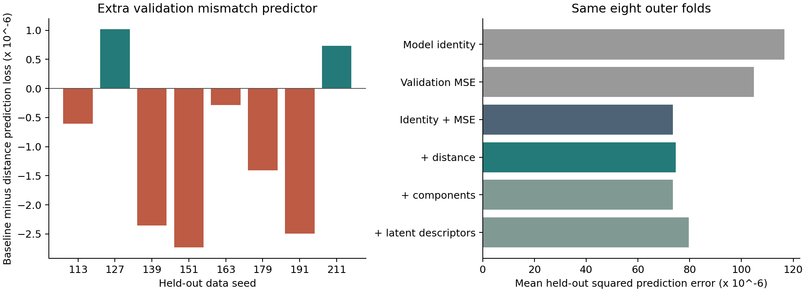

# Do validation descriptors predict shifted forecast error?

**Exploratory follow-up after test-result inspection.** These are predictions across eight held-out generator realizations, with all named models kept together within a realization. The target is forecast MSE, so the regression loss below has units of MSE squared.

The primary distance extension has mean held-out prediction loss 7.4553361e-05, versus 7.3538017e-05 for model identity plus validation forecast MSE. This changes prediction loss by +1.4% and improves 2/8 realization folds. Positive paired differences favor the extra predictor. This result does not establish a causal or necessary role for complexity preservation.



| Held-out data seed | Baseline loss | + distance loss | Baseline minus distance |
| --- | ---: | ---: | ---: |
| 113 | 3.8606576e-05 | 3.920968e-05 | -6.031048e-07 |
| 127 | 4.9010769e-05 | 4.7995137e-05 | +1.0156319e-06 |
| 139 | 7.9467715e-05 | 8.1820227e-05 | -2.3525113e-06 |
| 151 | 0.00011173634 | 0.00011446748 | -2.7311383e-06 |
| 163 | 4.8144811e-05 | 4.8431553e-05 | -2.8674221e-07 |
| 179 | 5.2105078e-05 | 5.3512311e-05 | -1.4072328e-06 |
| 191 | 4.7385838e-05 | 4.9877781e-05 | -2.4919429e-06 |
| 211 | 0.000161847 | 0.00016111272 | +7.3428857e-07 |

## All committed feature sets and endpoints

| Predictor set | Shifted common probe | ID common probe | Shifted native forecast |
| --- | ---: | ---: | ---: |
| Model identity | 0.00011667943 | 2.4098378e-05 | 0.00014835936 |
| Validation MSE | 0.00010477228 | 2.336336e-05 | 0.00014399223 |
| Identity + MSE | 7.3538017e-05 | 2.1826747e-05 | 0.00011697643 |
| + distance | 7.4553361e-05 | 2.2517723e-05 | 0.00012261824 |
| + components | 7.3546062e-05 | 2.2806359e-05 | 0.00012424297 |
| + latent descriptors | 7.9573264e-05 | 2.1046949e-05 | 0.00012800469 |

Each loss averages squared prediction errors over models within a realization, then equally over eight realizations. The common-probe endpoints include 14 cases per realization; the native endpoint includes 12 forecasting cases and excludes reconstruction-native PCA and random projection. Identity-only and validation-only are reference analyses. Scalar distance is the primary extension; component mismatches and latent descriptors are secondary. No best-performing extension is substituted for the primary result.

## Interpretation and limits

The baseline includes model identity, absorbing the fixed architecture and training-budget differences among the named procedures. The primary extension tests an additional scalar validation mismatch. All standardization, intercept fitting and ridge-penalty selection occur within the appropriate training folds. The target of every outer fold is a new data realization of the same generator with the same model set. Neither unseen architectures nor unseen generator families are evaluated.

Descriptors come from the two saved validation sequences, with 127 input time points each. They are not extracted from test sequences for the regression. They summarize order-three normalized permutation entropy averaged over usable scales 1 and 2, median-binarized normalized LZ76 and lag-one correlation. Each is averaged across coordinates. The scalar mismatch averages squared component differences, rescaling lag correlation by one half. It is not an MDL score or an information-preservation criterion.

The same eight benchmark realizations have already informed the scientific interpretation. Nested validation prevents regression fitting on each held-out outcome but does not undo prior inspection or make this follow-up confirmatory. There are eight analysis units, despite 112 common-probe model/data rows. No significance, confidence-interval or general quantum-advantage claim is supported.

## Coordinate controls

| Control quantity | Mean | Maximum |
| --- | ---: | ---: |
| rotation_descriptor_change | 0.0019344012 | 0.044531901 |
| rotation_prediction_max_difference | 2.8605868e-16 | 1.831868e-15 |
| scale_descriptor_change | 5.1698173e-33 | 1.0271626e-31 |
| shuffled_descriptor_change | 0.047107566 | 0.32437482 |

The controls use the existing forecast-task sequence rows. Compensated orthogonal rotations preserve the linear-probe predictions while changing coordinatewise temporal summaries. This demonstrates that descriptor distance is not an invariant measure of predictive information. Quantum summaries apply only to the retained single-qubit Z readouts.

## Reproduction

From a clean committed checkout with the pinned CPU dependencies:

```bash
OPENBLAS_NUM_THREADS=1 OMP_NUM_THREADS=1 python -m pilot.descriptor_study --output /tmp/descriptor_generalization
python scripts/report_descriptor_generalization.py /tmp/descriptor_generalization
```

Check saved fold coverage, loss aggregation and evidence hashes independently:

```bash
python scripts/verify_descriptor_generalization.py /tmp/descriptor_generalization
```

Analysis source commit: `33fd416f662fe5ea135e5edebc82dc151967ffca`. Original archive SHA-256: `e9c01d0ceb664c080708e7d78660da4042189dc6f62d25a0ba4a165d4f89a34d`. Validation features SHA-256: `99280797f4bf3ffa16bb8edbb40aa5f5e034139d3222897065e415d3454af575`.

All 112 restored validation-probe errors match saved metadata; maximum absolute difference 1.39e-17. Original selection-lock files and the validation-feature table remain unchanged. All 1920 held-out predictions are finite.

Files include `validation_features.csv`, `feature_lock.json`, `analysis_cells.csv`, `heldout_predictions.csv`, `fold_losses.csv`, `fold_audit.json`, `summary.json`, `verification.json` and `manifest.json`. The analysis configuration is `analysis_config.json`; the protocol is [the exploratory analysis plan](../descriptor_generalization_protocol.md). The original checkpoint archive remains in [the fresh-seed benchmark](../fresh_seed_forecasting/README.md).
