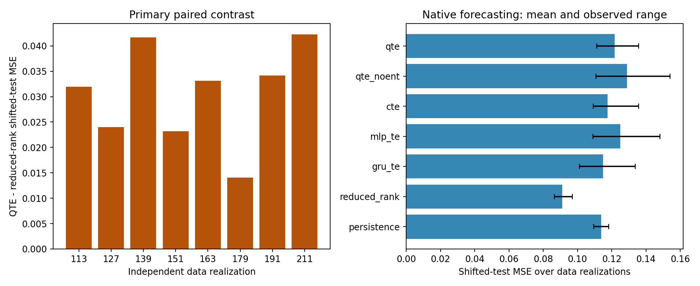

# Fresh-seed forecasting replication

Prespecified one-step teacher-forced forecasting study. All model and probe selections were locked before any test partitions were generated. Native forecast MSE over the five shifted conditions is the primary endpoint.

Data seeds: [113, 127, 139, 151, 163, 179, 191, 211]. Initialization seed: [303]. Every learning-rate candidate completed 8 epochs. Independent generator realizations, not sequences or shift conditions, are the analysis units.

## Primary contrast: QTE minus reduced-rank regression

Positive differences favor reduced-rank regression. Each score averages the four test sequences within each shifted condition, then gives the five conditions equal weight.

| Data seed | QTE | Reduced-rank | Difference |
| --- | ---: | ---: | ---: |
| 113 | 0.121088 | 0.089169 | +0.031918 |
| 127 | 0.111139 | 0.087122 | +0.024017 |
| 139 | 0.128229 | 0.086559 | +0.041670 |
| 151 | 0.115558 | 0.092375 | +0.023183 |
| 163 | 0.125030 | 0.091925 | +0.033105 |
| 179 | 0.111074 | 0.096982 | +0.014092 |
| 191 | 0.125652 | 0.091494 | +0.034158 |
| 211 | 0.135559 | 0.093310 | +0.042249 |

Mean difference: +0.030549. Observed range: +0.014092 to +0.042249. QTE has lower error in 0 of 8 realizations. No significance threshold or power claim was specified.

## Native forecasting references

Means below average per-realization scores. Reconstruction-only native objectives from PCA and random projection are excluded from this table. Their forecast probes are reported separately.

| Model | In-distribution MSE | Shifted-test MSE | Shifted-test observed range |
| --- | ---: | ---: | --- |
| qte | 0.067188 | 0.121666 | 0.111074 to 0.135559 |
| qte_noent | 0.074451 | 0.128927 | 0.110749 to 0.153947 |
| cte | 0.064519 | 0.117437 | 0.109189 to 0.135676 |
| mlp_te | 0.070666 | 0.124979 | 0.109040 to 0.148116 |
| gru_te | 0.071634 | 0.114797 | 0.101014 to 0.133737 |
| reduced_rank | 0.054157 | 0.091117 | 0.086559 to 0.096982 |
| persistence | 0.068573 | 0.113704 | 0.109423 to 0.118122 |
| untrained_qte | 0.074516 | 0.131094 | 0.110059 to 0.152459 |
| untrained_qte_noent | 0.107076 | 0.155167 | 0.137405 to 0.176775 |
| untrained_cte | 0.073582 | 0.131573 | 0.108598 to 0.148438 |
| untrained_mlp_te | 0.172473 | 0.245949 | 0.207100 to 0.264365 |
| untrained_gru_te | 0.136701 | 0.207232 | 0.191644 to 0.225338 |
| zero_output | 0.077863 | 0.145498 | 0.136813 to 0.152645 |
| training_mean | 0.077646 | 0.143150 | 0.131337 to 0.152192 |

## Common linear forecast probes

These secondary scores measure linear readout of each selected representation. Probe coefficients use training only and penalty selection uses validation only. Encoder checkpoint selection still uses native validation MSE. Persistence retains the full input, so its probe is an uncompressed reference.

| Model | In-distribution probe MSE | Shifted-test probe MSE |
| --- | ---: | ---: |
| qte | 0.057033 | 0.107755 |
| qte_noent | 0.056905 | 0.108760 |
| cte | 0.056822 | 0.110042 |
| mlp_te | 0.056815 | 0.098501 |
| gru_te | 0.063476 | 0.099974 |
| pca | 0.054017 | 0.089784 |
| reduced_rank | 0.054104 | 0.090744 |
| random_linear | 0.055229 | 0.098719 |
| persistence | 0.054188 | 0.091358 |
| untrained_qte | 0.057133 | 0.108299 |
| untrained_qte_noent | 0.057059 | 0.108188 |
| untrained_cte | 0.056546 | 0.109118 |
| untrained_mlp_te | 0.057363 | 0.100367 |
| untrained_gru_te | 0.065130 | 0.098835 |

## Every shifted condition

| Model | Mean shift | Variance shift | Persistence shift | Noise shift | Combined shift |
| --- | ---: | ---: | ---: | ---: | ---: |
| qte | 0.125757 | 0.105467 | 0.077817 | 0.118748 | 0.180542 |
| qte_noent | 0.114142 | 0.114228 | 0.092610 | 0.139229 | 0.184424 |
| cte | 0.103532 | 0.098582 | 0.082055 | 0.130800 | 0.172216 |
| mlp_te | 0.136313 | 0.112067 | 0.078776 | 0.114159 | 0.183580 |
| gru_te | 0.114482 | 0.110058 | 0.073687 | 0.113815 | 0.161940 |
| reduced_rank | 0.068446 | 0.079830 | 0.071769 | 0.103721 | 0.131820 |
| persistence | 0.053074 | 0.097300 | 0.104806 | 0.152077 | 0.161262 |

## Scope, selection and resource costs

These results evaluate a fixed eight-epoch procedure on bounded synthetic piecewise AR sequences. They do not establish converged architectural performance, computational quantum advantage or applicability to clinical/neuroimaging data. Compressed models share input and bottleneck sizes; persistence retains the full input. Models do not have equal parameter count or computational cost. Analytic coefficient matrices are not counted as gradient parameters.

The single fixed initialization seed limits inference about optimization variability. Fresh data replication addresses reuse of exploratory data, but remains within one known generator family. Common probe reconstruction metrics and coordinate-wise temporal descriptors are preserved in the sequence-level file as secondary/exploratory measurements. Descriptor distances are not MDL estimates or information-preservation guarantees.

Fitting wall time: 491.1 seconds with 4 independent fitting processes. Total wall time: 782.4 seconds. All runs use CPU and exact density-matrix quantum simulation; there is no measurement-shot noise.

| Model | Gradient parameters | Mean fitting elapsed seconds per realization |
| --- | ---: | ---: |
| qte | 8 | 122.32 |
| qte_noent | 8 | 104.74 |
| cte | 8 | 5.61 |
| mlp_te | 118 | 0.02 |
| gru_te | 108 | 0.24 |
| pca | 0 | 0.00 |
| reduced_rank | 0 | 0.00 |
| random_linear | 0 | 0.00 |
| persistence | 0 | 0.00 |

Source commit: `f6cc35a3b3eb12a3ad2c22eb0062e616e2f01951`. Selection lock: `9469b5c1509701cb66741c3c4a22756bead028cb887587ab4f3b812e0a7f7884`. All locked file hashes remain unchanged after evaluation and every saved dataset was independently regenerated byte-for-byte.

[Protocol](../fresh_seed_forecasting_protocol.md), [primary contrasts](primary_contrasts.json), [sequence-level outcomes](sequence_metrics.csv), [constant references](constant_forecast_metrics.csv), [selections](fit_diagnostics.json), [verification](verification.json) and [data/checkpoint archive](fresh_seed_forecasting_assets.zip).
