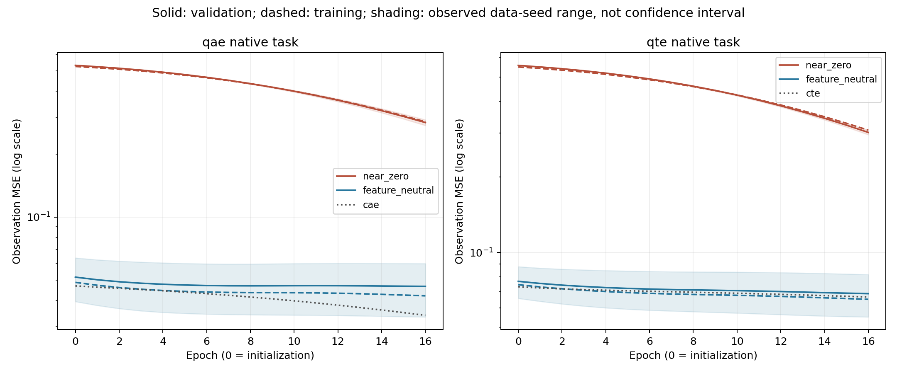

# Paired initialization control

**Training and validation only. No test partitions were generated or evaluated.**

Source commit: `7ad6679a47355f30f87b865d2abadfd302edc6d9`. 20 fitted cases over 2 data realizations, one initialization seed and one learning rate. Every trained case completed 16 epochs. Elapsed time: 555.2 seconds.

The quantum architecture, parameter count and initial encoder readouts are identical within each pair. Only existing first-block decoder parameters for discarded qubits are recentered. Calibration uses a synthetic zero-input reference without dataset access, then adds the original seed jitter. Classical baselines use the same partitions.

Validation also selects checkpoints and probe penalties. These values diagnose selection and optimization; they are not independent estimates of generalization.

## Native validation errors

Entries average 2 data realizations. The 8-epoch and 16-epoch columns summarize nested prefixes of one trajectory. They are not separate experiments. Closed-form models have no epoch budget.

| Model | Initialization | Initial validation MSE | Best through epoch 8 | Best through epoch 16 | Selected epochs |
| --- | --- | ---: | ---: | ---: | --- |
| qae | near_zero | 0.530855 | 0.434210 | 0.282889 | 16, 16 |
| qae | feature_neutral | 0.051656 | 0.046926 | 0.046520 | 16, 7 |
| qte | near_zero | 0.557596 | 0.460653 | 0.301266 | 16, 16 |
| qte | feature_neutral | 0.076662 | 0.070843 | 0.068460 | 16, 16 |
| cae | near_zero | 0.046903 | 0.041500 | 0.033930 | 16, 16 |
| cte | near_zero | 0.072952 | 0.069357 | 0.066378 | 16, 16 |
| mlp_ae | near_zero | 0.186923 | 0.072322 | 0.065400 | 5, 16 |
| gru_te | near_zero | 0.243161 | 0.086223 | 0.085154 | 5, 12 |
| pca | near_zero | n/a | 0.000922 | 0.000922 | n/a, n/a |
| reduced_rank | near_zero | n/a | 0.056472 | 0.056472 | n/a, n/a |



## Paired differences

Positive differences mean lower error for feature-neutral initialization. Each row is one data realization; two realizations do not support calibrated confidence intervals.

| Model | Data seed | Initial validation difference | Best validation difference at 16 epochs |
| --- | ---: | ---: | ---: |
| qae | 17 | 0.493024 | 0.240630 |
| qae | 41 | 0.465374 | 0.232108 |
| qte | 17 | 0.493822 | 0.239709 |
| qte | 41 | 0.468046 | 0.225903 |

## Selected representation probes

Shared ridge-probe coefficients are fitted on training latents; penalties are chosen on validation. Values average data realizations. The selected encoder depends on native validation checkpoint selection.

| Model | Initialization | Reconstruction probe validation MSE | Forecast probe validation MSE |
| --- | --- | ---: | ---: |
| qae | near_zero | 0.004333 | 0.055962 |
| qae | feature_neutral | 0.003579 | 0.056215 |
| qte | near_zero | 0.004157 | 0.056033 |
| qte | feature_neutral | 0.003558 | 0.056207 |
| cae | near_zero | 0.002490 | 0.055864 |
| cte | near_zero | 0.004627 | 0.056582 |
| mlp_ae | near_zero | 0.029095 | 0.066972 |
| gru_te | near_zero | 0.029240 | 0.064437 |
| pca | near_zero | 0.000922 | 0.055480 |
| reduced_rank | near_zero | 0.003929 | 0.055897 |

## Resource costs

| Model | Initialization | Total case seconds | Calibration seconds |
| --- | --- | ---: | ---: |
| qae | near_zero | 132.35 | 0.000 |
| qae | feature_neutral | 132.79 | 0.383 |
| qte | near_zero | 136.40 | 0.000 |
| qte | feature_neutral | 139.96 | 0.366 |
| cae | near_zero | 6.59 | 0.000 |
| cte | near_zero | 6.77 | 0.000 |
| mlp_ae | near_zero | 0.04 | 0.000 |
| gru_te | near_zero | 0.30 | 0.000 |
| pca | near_zero | 0.00 | 0.000 |
| reduced_rank | near_zero | 0.00 | 0.000 |

## Limits

This control isolates decoder initialization within each quantum model. It does not equalize information capacity across real coordinates and qubits, establish hardware advantage or demonstrate convergence. The calibrated centers are near zero readout on one synthetic reference; adding seed jitter means actual initial predictions are not exactly zero. Calibration cost is recorded separately in each case.

The data configuration has two training and two validation sequences of length 64 per realization. The model, learning-rate and seed coverage are deliberately narrow. Further optimization checks should add initialization seeds and learning rates before a confirmatory protocol is frozen. Held-out test outcomes must remain outside those decisions. Seeds 17 and 41 are exploratory realizations already used in earlier diagnostics; a confirmatory study must use fresh prespecified data seeds.

## Reproduce

The ZIP archive contains datasets, checkpoints and all run records. Its SHA-256 is in `verification.json`. Figure generation requires Matplotlib from `requirements-test.txt`.

```bash
python -m pilot.validation_control --config configs/initialization_control.json --output pilot_runs/initialization_control_reproduce
python scripts/report_initialization_control.py --run pilot_runs/initialization_control_reproduce --output docs/initialization_control
```
