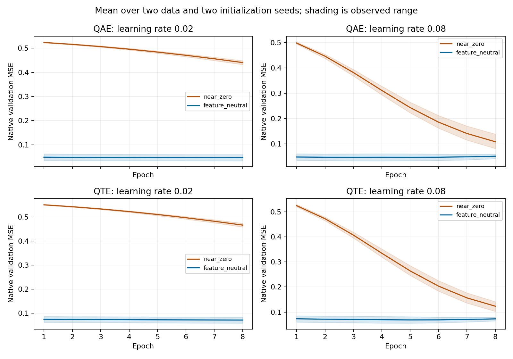

# Initialization and learning-rate sensitivity

Exploratory training/validation diagnostic. No test partitions were generated. Each trained case has an eight-epoch budget; native checkpoint selection uses minimum validation MSE within that budget.

Data seeds: [17, 41]. Initialization seeds: [101, 202]. Learning rates: [0.02, 0.08]. Sequences have length 64, with two training and two validation sequences per realization.

## Native validation results

Values below are descriptive means over the two data and two initialization seeds at each learning rate. These repeated fits do not provide four independent data realizations.

| Model | Initialization | LR 0.02 | LR 0.08 |
| --- | --- | ---: | ---: |
| qae | near_zero | 0.440267 | 0.108503 |
| qae | feature_neutral | 0.046814 | 0.046727 |
| qte | near_zero | 0.466011 | 0.123432 |
| qte | feature_neutral | 0.071033 | 0.067987 |
| cae | near_zero | 0.042497 | 0.022721 |
| cte | near_zero | 0.069745 | 0.063178 |
| mlp_ae | near_zero | 0.078741 | 0.053217 |
| gru_te | near_zero | 0.089379 | 0.079418 |
| pca | near_zero | 0.000922 | 0.000922 |
| reduced_rank | near_zero | 0.056472 | 0.056472 |

### Starting error and constant prediction references

Initial validation values below precede gradient training and are averaged over two data and two initialization seeds. Learning rate does not affect initialization.

| Quantum model | Near-zero initial | Feature-neutral initial |
| --- | ---: | ---: |
| qae | 0.530160 | 0.049701 |
| qte | 0.557219 | 0.075021 |

Constant predictors use zero output or the feature means estimated from training targets only. Values below average validation MSE over the two data realizations. They are references computed from existing data, not additional trained grid cases.

| Task | Zero output | Training mean |
| --- | ---: | ---: |
| reconstruction | 0.073019 | 0.081495 |
| forecast | 0.072321 | 0.081285 |

[Per-data constant reference scores](constant_baselines.json). Most of the paired error reduction is already present before gradient training. Feature-neutral starts remove a large starting-output penalty; the subsequent improvement over eight epochs is smaller. QAE reconstruction improves beyond a zero-output reference on these data. QTE forecasting is much closer to that reference, so the lower paired score alone does not demonstrate strong learned forecasting.

Shading shows the observed minimum and maximum over fits, not a confidence interval. PCA and reduced-rank references use analytic fitting without epochs; gradient parameter count is not model capacity. Native reconstruction and forecast objectives differ, so compare models within their task.

## Every paired quantum comparison

Positive difference means feature-neutral initialization reached lower minimum validation MSE.

| Model | Data seed | Initialization seed | Learning rate | Near-zero | Feature-neutral | Difference |
| --- | ---: | ---: | ---: | ---: | ---: | ---: |
| qae | 17 | 101 | 0.02 | 0.431723 | 0.034149 | +0.397574 |
| qte | 17 | 101 | 0.02 | 0.458201 | 0.058020 | +0.400180 |
| qae | 17 | 101 | 0.08 | 0.081874 | 0.034164 | +0.047710 |
| qte | 17 | 101 | 0.08 | 0.102770 | 0.055684 | +0.047086 |
| qae | 17 | 202 | 0.02 | 0.444575 | 0.033686 | +0.410889 |
| qte | 17 | 202 | 0.02 | 0.468974 | 0.059965 | +0.409009 |
| qae | 17 | 202 | 0.08 | 0.095045 | 0.033237 | +0.061808 |
| qte | 17 | 202 | 0.08 | 0.122722 | 0.057521 | +0.065201 |
| qae | 41 | 101 | 0.02 | 0.436696 | 0.059702 | +0.376994 |
| qte | 41 | 101 | 0.02 | 0.463105 | 0.083666 | +0.379438 |
| qae | 41 | 101 | 0.08 | 0.118362 | 0.059693 | +0.058669 |
| qte | 41 | 101 | 0.08 | 0.126705 | 0.079394 | +0.047311 |
| qae | 41 | 202 | 0.02 | 0.448075 | 0.059718 | +0.388357 |
| qte | 41 | 202 | 0.02 | 0.473762 | 0.082481 | +0.391282 |
| qae | 41 | 202 | 0.08 | 0.138730 | 0.059812 | +0.078918 |
| qte | 41 | 202 | 0.08 | 0.141529 | 0.079350 | +0.062179 |

## Interpretation and provenance

Feature-neutral initialization has lower minimum validation MSE in 16 of 16 paired fits. This is an optimization diagnostic on two previously inspected synthetic data realizations. It cannot establish superiority, calibrated uncertainty or out-of-distribution generalization. A confirmatory study needs fresh data seeds and a fixed protocol before test evaluation.

Increasing the learning rate substantially lowers near-zero error, while feature-neutral outcomes change much less. The initialization effect persists throughout this grid, but its magnitude depends on the learning rate. Classical ring, PCA and reduced-rank references remain competitive or better for their respective native tasks. These results do not demonstrate quantum advantage.

The initialization changes existing decoder parameter centers using a data-free zero-input reference. Parameter counts and initial encoder readout hashes match in every quantum pair. Initial ridge-probe validation results also match. Post-training probe scores from 16-epoch checkpoints are not presented as eight-epoch results.

Source commit for the three new cells: `eeb6787b3800bd3c508506a84495fe09905b6179`. Reused seed-101/rate-0.02 trajectories originate at `7ad6679a47355f30f87b865d2abadfd302edc6d9`. Simulation-source hashes and dataset manifests were checked before reuse. Only native histories through epoch eight are reused. The historical archive contains 16-epoch selected checkpoints; it does not contain eight-epoch selected checkpoints for the reused cell.

3 new grid cells and 1 reused trajectory cell yield 80 native records. New computation took 814.1 seconds, excluding the earlier control. Every new cell records a clean source tree and its environment manifest.

[Machine-readable native records](native_sensitivity_records.json), [grid provenance](grid_manifest.json), [verification](verification.json) and [datasets, trajectories and checkpoint archive](initialization_sensitivity_assets.zip).

Reproduce using the commands in [the protocol](../initialization_control_protocol.md). The report generator checks complete case coverage, finite trajectories, paired hashes, source provenance and the absence of test partitions.
