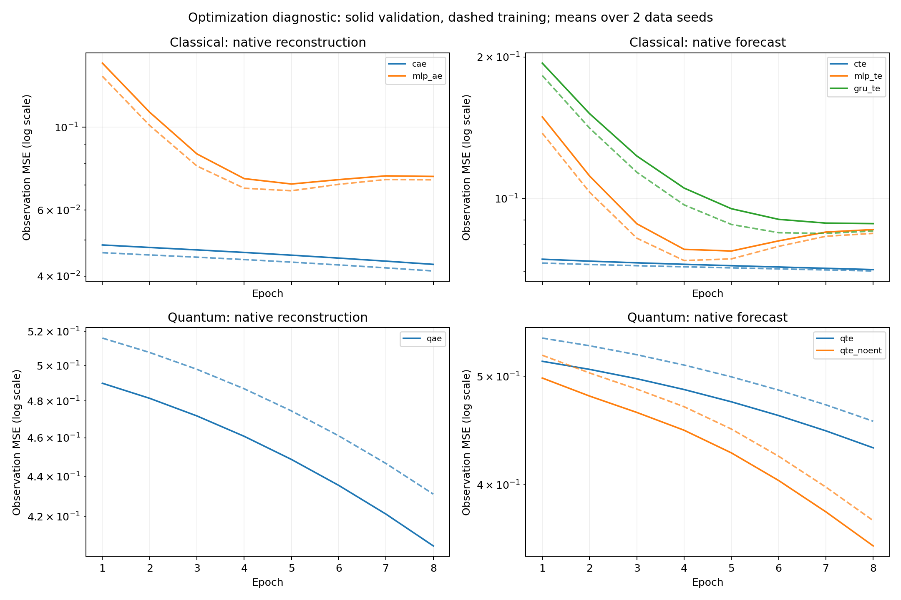
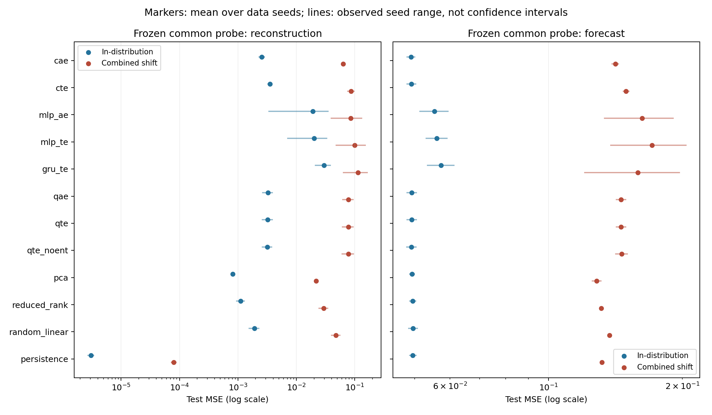

# Optimization diagnostic

**Exploratory training diagnostic. No significance, convergence or quantum-advantage claims.**

Source commit: `955889814e475f98e23e592c2382bf1c74915227`. Clean source at run start: True.

Run: 8 epochs, 2 independent data seeds, one initialization seed and one learning rate (0.02). Each seed has 2 training, 2 validation and 2 test sequences per regime, each of length 128. Elapsed time: 449.2 seconds. 960 sequence-task records.

## Optimization

Native-task MSE is distinct from common probe MSE. Selected training MSE comes from the minimum-validation epoch. Each listed epoch corresponds to one data seed. A best checkpoint at the last epoch suggests extending the budget; it does not establish convergence. Fit seconds include all data seeds.

| Model | Initial train MSE | Selected train MSE | Selected validation MSE | Selected epochs | Fit seconds |
| --- | ---: | ---: | ---: | --- | ---: |
| cae | 0.046997 | 0.041283 | 0.042997 | 8, 8 | 6.0 |
| cte | 0.073584 | 0.070199 | 0.070673 | 8, 8 | 5.9 |
| mlp_ae | 0.186000 | 0.065863 | 0.070212 | 6, 4 | 0.0 |
| mlp_te | 0.186199 | 0.073012 | 0.077243 | 5, 4 | 0.0 |
| gru_te | 0.243517 | 0.084933 | 0.087318 | 6, 8 | 0.2 |
| qae | 0.523820 | 0.431056 | 0.406025 | 8, 8 | 126.8 |
| qte | 0.548494 | 0.455884 | 0.431598 | 8, 8 | 128.4 |
| qte_noent | 0.542767 | 0.371572 | 0.352730 | 8, 8 | 107.7 |

Quantum fits selecting the final epoch: 6/6. This is evidence that the tested budget should be extended, not a convergence certificate.

On the same validation partitions, qae native reconstruction MSE averages 0.406025, while the common reconstruction probe averages 0.003448. The gap supports investigating native decoder optimization before drawing representation-quality conclusions.



## Shared readout probes

All models receive the same ridge-probe procedure. Each probe is fit on training latents and its penalty is chosen on validation only. Values below average test sequences within each data seed, then average seeds. Persistence is an uncompressed reference. Quantum probes access retained Z expectations, not the full state.

| Model | Reconstruction ID | Reconstruction combined | Forecast ID | Forecast combined |
| --- | ---: | ---: | ---: | ---: |
| cae | 0.002559 | 0.062986 | 0.049012 | 0.141243 |
| cte | 0.003550 | 0.086133 | 0.049144 | 0.149421 |
| mlp_ae | 0.018998 | 0.084670 | 0.055359 | 0.162227 |
| mlp_te | 0.020140 | 0.099165 | 0.056041 | 0.170779 |
| gru_te | 0.029697 | 0.113211 | 0.057273 | 0.158720 |
| qae | 0.003250 | 0.077787 | 0.049207 | 0.145606 |
| qte | 0.003243 | 0.077619 | 0.049211 | 0.145585 |
| qte_noent | 0.003193 | 0.077551 | 0.049134 | 0.145977 |
| pca | 0.000816 | 0.021638 | 0.049309 | 0.128275 |
| reduced_rank | 0.001117 | 0.029401 | 0.049451 | 0.131344 |
| random_linear | 0.001919 | 0.047424 | 0.049574 | 0.137120 |
| persistence | 0.000003 | 0.000080 | 0.049476 | 0.131889 |



## Descriptor controls

Maximum compensated rotation prediction difference: 5.773e-15. Maximum scale descriptor change: 2.013e-31. The rotation control preserves probe predictions while temporal descriptors can change. Positive scaling should preserve these ordinal, median-threshold and correlation descriptors. Neither result establishes preservation of the full quantum state.

| Model | Mean rotation descriptor change | Mean time-shuffle descriptor change |
| --- | ---: | ---: |
| cae | 0.001264 | 0.036153 |
| cte | 0.001181 | 0.033872 |
| mlp_ae | 0.002310 | 0.041963 |
| mlp_te | 0.001041 | 0.039388 |
| gru_te | 0.001756 | 0.103518 |
| qae | 0.001332 | 0.034431 |
| qte | 0.001281 | 0.034336 |
| qte_noent | 0.001113 | 0.035026 |
| pca | 0.001685 | 0.038802 |
| reduced_rank | 0.001606 | 0.040529 |
| random_linear | 0.002728 | 0.046195 |
| persistence | 0.000730 | 0.033986 |

## Limits and next experiment

Two data seeds and one initialization provide descriptive replication only. The small training partition and short budget cannot establish model rankings. Descriptor estimates at this sequence length use scales 1 and 2; scale 4 fails the minimum embedding-vector count. Test outcomes must not be used to tune the confirmatory protocol.

Generator terminology: the stored `variance_ratio` field multiplies the latent standard deviation, so its stationary variance multiplier is the square of that value (2.25 for the base middle segment and 9 for the variance-shift middle segment). These multipliers refer to latent innovations and stationary regimes; observed tanh features and transition transients need not have those ratios.

The quantum reset convention creates discarded qubits in computational zero, whose Z readout is +1. The classical discarded coordinates start at feature zero. Near-zero trainable rotation initialization therefore gives different native decoder starting predictions. Inspect longer optimization and a separately specified feature-neutral quantum decoder initialization before interpreting native-score gaps. This initialization diagnostic must be developed from training/validation behavior, not held-out test rankings.

Use the larger configured pilot only after inspecting optimization, learning-rate sensitivity, initialization sensitivity and runtime. A confirmatory study needs more independent data realizations and uncertainty at the data-realization level.

## Reproduce

The accompanying `reproducibility_assets.zip` contains all generated datasets, checkpoints, probes and run records. Its SHA-256 is recorded in `verification.json`. The figure script requires Matplotlib, included in `requirements-test.txt`.

```bash
python -m pilot.run --config configs/optimization_diagnostic.json --output pilot_runs/optimization_reproduce
python scripts/report_optimization_diagnostic.py --run pilot_runs/optimization_reproduce --output docs/optimization_diagnostic
```
